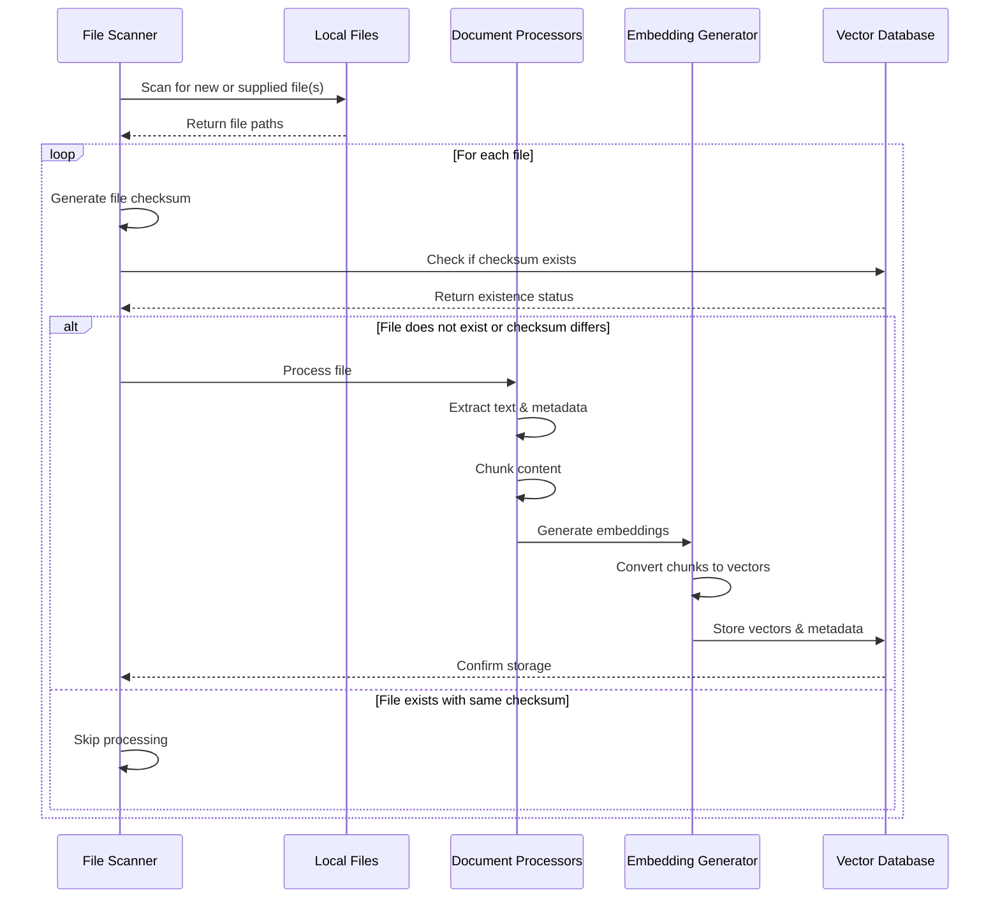

# Adding Files Flow

## Table of Contents
1. [Overview](#1-overview)
2. [System Flow](#2-system-flow)
3. [Components](#3-components)
   3.1. [File Scanner](#31-file-scanner)
      3.1.1. [File Scanner (file_scanner.py)](#311-file-scanner-file_scannerpy)
   3.2. [Document Processors](#32-document-processors)
      3.2.1. [Document Metadata](#321-document-metadata)
      3.2.2. [Core Components](#322-core-components)
         3.2.2.1. [Base Document Processor](#3221-base-document-processor)
         3.2.2.2. [Supported Processors](#3222-supported-processors)
      3.2.3. [Interface Specification](#323-interface-specification)
      3.2.4. [Configuration](#324-configuration)
      3.2.5. [Integration](#325-integration)
      3.2.6. [Error Handling](#326-error-handling)
      3.2.7. [Extensibility](#327-extensibility)
      3.2.8. [Future Enhancements](#328-future-enhancements)
   3.3. [Embedding Generator](#33-embedding-generator)

## 1. Overview
The Adding Files Flow describes the process of scanning, processing, and embedding files into the vector database for later retrieval and querying. This flow is initiated through the [Main Module](ARCHITECTURE-common-components.md#2-main-module) using the `--add` command-line argument.

The flow utilizes several common components:
- [Configuration Module](ARCHITECTURE-common-components.md#3-configuration-module): For loading and managing configuration settings
- [Logging Setup](ARCHITECTURE-common-components.md#4-logging-setup): For consistent logging across all components
- [Vector Database](ARCHITECTURE-common-components.md#5-vector-database): For storing and managing embeddings and metadata

## 2. System Flow


## 3. Components

### 3.1. File Scanner
- **Purpose**: Handles discovery of local files and selection of appropriate Document Processor
- **Dependencies**:
  - [Configuration Module](ARCHITECTURE-common-components.md#3-configuration-module) for file scanning settings
  - [Logging Setup](ARCHITECTURE-common-components.md#4-logging-setup) for operation tracking
  - [Vector Database](ARCHITECTURE-common-components.md#5-vector-database) for checking existing files
  - [Exceptions Module](ARCHITECTURE-common-components.md#6-exceptions-module) for error handling
- **Key Functions**:
  - Exclusion and inclusion of identified files and directories using gitignore notation
  - Generation of SHA256 hash of file for comparison and for the Document Processors
  - Exclusion of existing files that have already been processed
  - File format detection, for example:
    - ASCII based file types
      - TXT
      - MD
      - CSV
    - Binary based file types vs PDFs vs images, etc
      - PDF
      - Image files
  - Selection of appropriate Document Processor (ie use the Markdown Document Processor for MD files)
- **Technologies**:
  - Python pathlib
  - hashlib for checksums

#### 3.1.1. File Scanner (file_scanner.py)
- **Purpose**: Discovers and validates files for processing, manages file selection based on configuration, generates file checksums, and checks against Vector DB to avoid reprocessing
- **Integration with Main**:
  - Receives paths from main's --add argument (supports both directories and individual files)
  - Receives configuration either from default or main's --config argument
  - Loads VECTOR_STORE configuration from config.py for Vector DB integration
  - Interacts with Vector DB to check for existing files
- **Input**:
  - `path`: Path to scan (can be a directory or individual file, provided by main's --add argument)
  - `vector_db`: Instance of Vector DB for checking existing files
  - Configuration settings (from config.FILE_SCANNER and config.VECTOR_STORE, loaded by main):
    - `EXCLUDE_PATTERNS`: List of gitignore-style patterns for file exclusion/inclusion
      - Permits all files by default
      - Supports standard gitignore pattern syntax
      - Use `!` prefix to explicitly include files that would otherwise be excluded
      - Example: `!README.md` ensures README.md is processed even if `.md` files are excluded
    - `HASH_ALGORITHM`: Hash algorithm for checksums (default: 'sha256')
    - `ALLOWED_EXTENSIONS`: List of file extensions to process
    - `DOCUMENT_PATH`: Default path for documents to be processed
    - `VECTOR_STORE`: Vector database configuration including:
      - `TYPE`: Vector store implementation
      - `PERSIST_DIRECTORY`: Data storage location
      - `COLLECTION_NAME`: Name of collection
      - `DISTANCE_METRIC`: Similarity metric
- **Output**:
  - List of dictionaries containing:
    - `path`: Relative path of each file
    - `checksum`: File's cryptographic hash
    - `needs_processing`: Boolean indicating if file needs to be processed (True if checksum not found in Vector DB)
- **Key Functions**:
  - `should_process_file`: Validates files against configured patterns
  - `calculate_checksum`: Generates cryptographic hashes using configured algorithm
  - `scan_files`: Processes individual files or recursively discovers files in directories. If a file path is provided, only that file is processed (if allowed and not excluded). If a directory is provided, all files in it are processed recursively.
  - `check_existing_files`: Queries Vector DB to identify which files need processing based on checksums
- **Logging Integration**:
  - Uses module-level logger for operation tracking
  - Log levels:
    - INFO: File processing progress and skipped files
    - DEBUG: Detailed file validation decisions and checksum comparisons
    - ERROR: File access or processing failures
- **Usage**:
```python
from embed_files.file_scanner import FileScanner
from embed_files.vector_system import VectorStore

# Initialize components
config = get_config()
scanner = FileScanner(config)

# Scan a directory
files = scanner.scan_files("/path/to/directory")
# Returns only files that need processing (not in vector db)

# Process a single file
files = scanner.scan_files("/path/to/specific_file.md")
# Returns a list with a single file if allowed and not excluded

# Process multiple inputs
files = scanner.scan_files(["/path/to/file1.md", "/path/to/directory", "/path/to/file2.pdf"])
```

For usage examples and configuration, see [Configuration Module Usage](ARCHITECTURE-common-components.md#33-usage) and [Main Module Usage](ARCHITECTURE-common-components.md#23-usage).

### 3.2. Document Processors
- **Purpose**: Handles ingestion and preprocessing of local files of specific filetypes
- **Dependencies**:
  - [Configuration Module](ARCHITECTURE-common-components.md#3-configuration-module) for processing settings
  - [Logging Setup](ARCHITECTURE-common-components.md#4-logging-setup) for operation tracking
  - [Exceptions Module](ARCHITECTURE-common-components.md#6-exceptions-module) for error handling
- **Key Functions**:
  - Text extraction and normalization
  - Content chunking
  - Metadata extraction
    - File metadata (creation time, modification time, filename, path, etc)
    - Document filetype specific information and relationships (ie hashtags, internal links, topics, etc)
  - Format-specific processing
- **Technologies**:
  - Python
  - Custom chunking algorithms
  - Format-specific libraries (PyPDF2, markdown, etc.)

#### Usage Example
All document processors follow the same interface, regardless of file type:

```python
from embed_files.document_processors import get_processor_for_file_type
from embed_files.config import get_config

# Initialize configuration
config = get_config()

# Get appropriate processor for file type
file_path = "/path/to/document.pdf"  # Could be .md, .txt, .csv, etc.
processor = get_processor_for_file_type(file_path, config)

# Prepare initial metadata
metadata = {
    "path": file_path,
    "file_type": "pdf",  # Automatically determined from file extension
    "filename": "document.pdf",
    "checksum": "abc123..."  # Provided by File Scanner
}

# Process document - same interface for all processors
processed_data = processor.process(file_path, metadata)

# processed_data contains:
# - Extracted text chunks
# - Enhanced metadata
# - Processing status
# - Any file-type specific information
```

#### 3.2.1. Document Metadata
- **File Metadata**:
  - `path`: Absolute file path
  - `relative_path`: Path relative to workspace root
  - `directory`: Full directory hierarchy
  - `filename_full`: Descriptive filename with extension
  - `filename_stem`: Descriptive filename without extension
  - `file_type`: Document format/extension
  - `created_at`: Creation timestamp
  - `last_modified`: Last modification timestamp
  - `checksum`: SHA256 hash of the file
  - `chunk_count`: Number of text chunks
  - `total_tokens`: Total token count
  - `url`: Any URL or link found in the document (Markdown, wikilinks, HTML links, etc.)
  - `url_external`: Any external URL (starting with `http://`, `https://`, etc.)
  - `url_internal`: Internal document links (Markdown or wikilinks that do not start with `http://` or `https://`)

- **Chunk Metadata** (applies to every chunk, not just the document):
  - All file/document-level metadata (inherited)
  - `chunk_index`: Index of the chunk in the document
  - `start_offset`, `end_offset`: Character or line offsets in the original document
  - `section_header`: The name of the section header (e.g., chapter title) for all associated chunks (PDF, Markdown)
  - `section_hierarchy`: List of all parent section headers for the chunk (e.g., ["Chapter 1", "Section 1.2"])
  - `tags`: Tags relevant to the chunk (from YAML, inline, or propagated from parent sections)
  - `urls`: URLs found in the chunk
  - `url_contexts`: List of dicts with `url` and its context (e.g., paragraph, header, table, code block)
  - `page_number`: (PDF/Image) Page number for the chunk
  - `chunk_type`: (Image) Type of chunk (e.g., ocr_text, vision_labels)
  - `topics`: List of topics or categories assigned to the chunk (NLP-based)
  - `summary`: Short summary of the chunk (NLP-based)

> Note: `topics` and `summary` are generated using NLP models and are available for all processors that support text content. These fields are extensible and may be added to more processors in the future.

#### 3.2.2. Core Components

##### 3.2.2.1. Base Document Processor
- **Module**: `base_processor.py`
- **Responsibilities**:
  - Defines common interface for all document processors
  - Provides logging setup
  - Implements shared utility functions
  - Requires implementation of `process()` method by subclasses
  - Implements sentence-aware text chunking to preserve sentence boundaries
  - Provides hooks for chunk-level metadata assignment (section, tag, url, position, etc.)

##### 3.2.2.2. Supported Processors
1. **PDF Processor** (`pdf_processor.py`):
   - Text extraction with page and section preservation
   - Header pattern recognition (detects section/chapter headers)
   - Intelligent chunking based on section boundaries and sentence/paragraph preservation
   - Propagates section headers and section hierarchy to all associated chunks
   - Tag propagation from higher-level sections (if tags are detected)
   - Tracks URL context (e.g., paragraph, header, table)
   - Adds chunk position metadata (chunk_index, start_offset, end_offset, page_number)
   - PDF-specific metadata extraction
   - Token counting using tiktoken
   - **PDF-specific metadata** (in addition to core and chunk metadata):
     - `page_count`: Number of pages in the PDF
     - `pdf_properties`: Dictionary of PDF document properties (title, author, subject, etc.)
     - `embedded_metadata`: Any embedded XMP or custom metadata
     - `digital_signatures`: List of digital signature information, if present
     - `security_settings`: Document security settings (encryption, permissions, etc.)
     - `structure_map`: Section hierarchy, page boundaries, headers/footers, etc.
     - `content_statistics`: Table/figure/form counts, text/image/table extraction stats
     - `layout_info`: Page coordinates, text positioning, element relationships, visual hierarchy

2. **Text Processor** (`text_processor.py`):
   - Plain text file processing
   - Sentence-aware chunking
   - Adds chunk position metadata (chunk_index, start_offset, end_offset)
   - Tracks URL context (e.g., paragraph)
   - **Text-specific metadata**:
     (none currently)
   
3. **Markdown Processor** (`markdown_processor.py`):
   - Markdown document processing
   - Sentence-aware chunking with markdown structure and section hierarchy preservation
   - Tracks full section hierarchy (H1 > H2 > H3, etc.)
   - Propagates tags from YAML frontmatter and inline hashtags, as well as from parent sections
   - Tracks URL context (markdown_link, raw_url, code block, etc.)
   - Adds chunk position metadata (chunk_index, start_offset, end_offset)
   - **Markdown-specific metadata**:
     - `tags`: Tags extracted from YAML frontmatter or hashtags (with `#` removed)
   
4. **CSV Processor** (`csv_processor.py`):
   - CSV file processing
   - Row-based chunking with header preservation
   - Adds chunk position metadata (chunk_index, start_offset, end_offset)
   - Tracks URL context (e.g., cell, header)
   - **CSV-specific metadata**:
     - (Add any CSV-specific metadata fields here if needed, e.g., `header_fields`, `row_count`)
   
5. **Vision Document Processor** (`vision_processor.py`):
   - Support for multiple image formats (jpg, jpeg, png, gif, bmp, webp)
   - Integration with Google Vision API for image analysis
   - Passes both the processed image data and Vision API results to the Embedding Generator
   - Each chunk (OCR text, label summary) gets its own chunk_type and position metadata
   - Tracks URL context (e.g., ocr_text, vision_labels)
   - **Image-specific metadata**:
     - `image_dimensions`: Width and height in pixels
     - `image_format`: File format (e.g., PNG, JPEG)
     - `color_profile`: Color profile information
     - `vision_labels`: Labels/objects detected by Vision API
     - `ocr_text`: Text content extracted via OCR
     - `face_detection`: Face detection results (if enabled)
     - `safe_search`: Safe search annotations
     - `feature_confidence`: Confidence scores for detected features
     - `processing_timestamp`: When the image was processed
     - `error_states`: Any error or warning states encountered

---

**Note:**
- All processors now assign chunk-level metadata for every chunk, including section, tag, url, context, and position fields.
- Section and tag propagation is hierarchical: tags/headers from parent sections are inherited by all sub-sections/chunks unless overridden.
- URL context is tracked for each URL in a chunk.
- Chunk position metadata is always included.
- The metadata structure is extensible for future types (e.g., author, language, table/figure context, etc.).

#### 3.2.3. Interface Specification

##### Input Parameters
- `file_path`: Path to the document to process
- `metadata`: Initial metadata dictionary containing:
  - `path`: Absolute file path
  - `file_type`: Document format/extension
  - `filename`: Name of the file
  - `checksum`: SHA256 hash of the file (provided by File Scanner)

##### Output Format
- **Document Metadata**:
  - All input metadata fields
  - Processing timestamp
  - Processor type used
  - Chunk information (if applicable)
  - Document-specific metadata (varies by processor)
- **Chunks**:
  - List of dicts, each with:
    - `text`: The chunk text
    - `metadata`: Chunk-level metadata as described above

#### 3.2.4. Configuration
```yaml
DOCUMENT_PROCESSING:
  MAX_CHUNK_SIZE: 3072     # Maximum size of text chunks
  MIN_CHUNK_SIZE: 1024     # Minimum chunk size to prevent tiny chunks
  CHUNK_OVERLAP: 768       # Overlap between chunks
  CONCURRENT_TASKS: 6      # Number of parallel tasks
  BATCH_SIZE: 50          # Documents per batch
  PRESERVE_SENTENCES: true # Ensure chunks don't break sentences
```

#### 3.2.5. Integration
The Document Processors integrate with other system components in the following ways:

##### File Scanner Integration
- Scanner maintains extension-to-processor mapping
- Automatically selects processor based on file extension
- Provides initial metadata to processor
- Handles processor initialization and error handling

##### Embedding Generator Integration
- Prepares text chunks optimized for embedding generation
- Ensures chunk sizes are within model token limits
- Maintains document structure information for context
- Provides metadata required for embedding tracking
- Handles special content types (e.g., image data from Vision Processor)
- See [Embedding Generator](#33-embedding-generator) for details

#### 3.2.6. Error Handling
- Each processor implements specific error handling
- Errors are logged with appropriate context
- Processing continues despite individual failures
- Failed documents are tracked in metadata

#### 3.2.7. Extensibility
- New processors can be added by:
  1. Creating new class inheriting from `BaseDocumentProcessor`
  2. Implementing required `process()` method
  3. Adding mapping in `FileScanner.DEFAULT_PROCESSOR_MAP`
  4. Updating configuration if needed

#### 3.2.8. Future Enhancements
- Support for additional file formats (docx, rtf, html, ppt)
- Enhanced metadata extraction
- Improved chunking strategies
- OCR integration for images
- Language detection and handling

### 3.3. Embedding Generator
- **Purpose**: Generates vector embeddings for document chunks and images using Google's models documented here: https://ai.google.dev/gemini-api/docs/embeddings
- **Dependencies**:
  - [Configuration Module](ARCHITECTURE-common-components.md#3-configuration-module) for model settings
  - [Logging Setup](ARCHITECTURE-common-components.md#4-logging-setup) for operation tracking
  - [Vector Database](ARCHITECTURE-common-components.md#5-vector-database) for storing embeddings
  - [Exceptions Module](ARCHITECTURE-common-components.md#6-exceptions-module) for error handling
- **Input**:
  - Document chunks and metadata from Document Processors
  - Raw image data and Vision API analysis from Vision Document Processor
  - Configuration settings (from config.EMBEDDING_MODEL):
    - `MODEL_NAME`: Name of Gemini model to use (embedding-001)
    - `BATCH_SIZE`: Number of chunks to process in each batch
    - `MAX_LENGTH`: Maximum text length per chunk (3072 tokens)
    - `DIMENSIONS`: Output embedding dimensions (768 or 1024)
- **Output**:
  - Vector embeddings for each chunk
  - Image embeddings incorporating both visual and textual features
  - Updated metadata including:
    - `embedding_model`: Model used for generation
    - `embedding_timestamp`: When embeddings were generated
    - `embedding_dimensions`: Size of generated vectors
    - `chunk_embeddings`: List of generated embeddings
    - `embedding_status`: Success/failure status per chunk

- **Key Functions**:
  - `generate_embeddings`: Main entry point for embedding generation
    - Handles batching of chunks
    - Manages concurrent processing
    - Implements retry logic
  - `generate_image_embeddings`: Specialized handling for image data
    - Processes raw image data
    - Incorporates Vision API analysis results
    - Generates multimodal embeddings
  - `validate_embeddings`: Ensures generated embeddings meet requirements
    - Checks dimensions
    - Validates vector values
    - Verifies completeness
  - `prepare_for_vector_store`: Formats embeddings and metadata for storage
    - Structures data for vector store requirements
    - Adds necessary indexing information
    - Prepares batch operations

- **Integration Points**:
  - Receives processed chunks from Document Processors
  - Uses logging_setup.py for operation tracking:
    - INFO: Batch processing progress
    - DEBUG: Individual chunk processing details
    - ERROR: Generation or validation failures
  - Outputs directly to Vector Store component

- **Usage**:
```python
from embed_files.embedding_generator import EmbeddingGenerator
from embed_files.config import get_config

# Initialize the generator with configuration
config = get_config()
generator = EmbeddingGenerator(config)

# Example document chunks and metadata from a Document Processor
chunks = [
    "First chunk of text from the document...",
    "Second chunk containing important information...",
    "Final chunk with concluding remarks..."
]

metadata = {
    "path": "/path/to/document.pdf",
    "file_type": "pdf",
    "filename": "document.pdf",
    "chunk_count": len(chunks),
    "checksum": "abc123..."
}

# Generate embeddings for text chunks
embeddings = generator.generate_embeddings(
    chunks=chunks,
    metadata=metadata
)

# Example image data from Vision Document Processor
image_data = {
    "text_content": "Text extracted from image via OCR",
    "labels": ["detected", "objects", "in", "image"],
    "vision_analysis": {...}  # Vision API analysis results
}

image_metadata = {
    "path": "/path/to/image.jpg",
    "file_type": "jpg",
    "filename": "image.jpg",
    "dimensions": "1920x1080",
    "checksum": "def456..."
}

# Generate embeddings for image content
image_embeddings = generator.generate_image_embeddings(
    image_data=image_data,
    metadata=image_metadata
)

# Both text and image embeddings will be in the format:
# {
#     'embeddings': List[List[float]],  # Vector embeddings
#     'metadata': Dict,                 # Enhanced metadata
#     'status': str,                    # Processing status
#     'model_info': {                   # Model information
#         'name': str,                  # Model used
#         'dimensions': int,            # Vector dimensions
#         'timestamp': str              # Generation time
#     }
# }
```

For configuration examples, see [Configuration Module Usage](ARCHITECTURE-common-components.md#33-usage).

