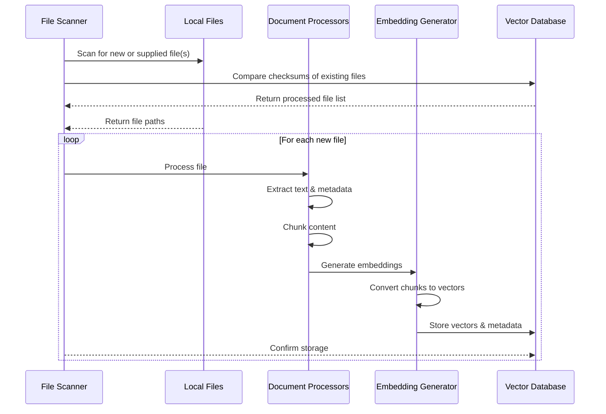

# Adding Files Flow



#### Add Flow Components

##### File Scanner
- **Purpose**: Handles discovery of local files and selection of appropriate Document Processor
- **Key Functions**:
  - Exclusion and inclusion of identified files and directories using gitignore notation
  - Generation of SHA256 hash of file for comparison and for the Document Processors
  - Exclusion of existing files that have already been processed
  - File format detection, for example:
    - ASCII based file types
      - TXT
      - MD
      - CSV
    - Binary based file types vs PDFs vs images, etc
      - PDF
      - Image files
  - Selection of appropriate Document Processor (ie use the Markdown Document Processor for MD files)
- **Technologies**:
  - Python pathlib
  - hashlib for checksums

##### Document Processors
- **Purpose**: Handles ingestion and preprocessing of local files of specific filetypes
- **Key Functions**:
  - Text extraction and normalization
  - Content chunking
  - Metadata extraction
    - File metadata (creation time, modification time, filename, path, etc)
    - Document filetype specific information and relationships (ie hashtags, internal links, topics, etc)
  - Format-specific processing
- **Technologies**:
  - Python
  - Custom chunking algorithms
  - Format-specific libraries (PyPDF2, markdown, etc.)

###### Document Metadata
- **File Metadata**:
  - `path`: Absolute file path
  - `relative_path`: Path relative to workspace root
  - `directory`: Full directory hierarchy
  - `filename_full`: Descriptive filename with extension
  - `filename_stem`: Descriptive filename without extension
  - `file_type`: Document format/extension
  - `created_at`: Creation timestamp
  - `last_modified`: Last modification timestamp
  - `chunk_count`: Number of text chunks
  - `total_tokens`: Total token count
  - `checksum`: SHA256 hash of the file

###### Vision Document Processor (vision_processor.py)
- **Purpose**: Processes image files using Google Cloud Vision API to extract visual information and prepare it for embedding generation

- **Input**:
  - Image files in supported formats (PNG, JPEG, GIF, BMP, WEBP)
  - Configuration settings from config.DOCUMENT_PROCESSING.VISION_PROCESSOR:
    - API version and credentials
    - Enabled feature types
    - Batch processing parameters
    - Performance settings

- **Output**:
  - Structured image analysis results including:
    - OCR text extraction
    - Object detection and localization
    - Label detection and classification
    - Face detection results
    - Safe search annotations
    - Image properties (color, quality, etc.)
  - Processed metadata:
    - Image dimensions and format
    - Processing timestamp
    - Feature detection confidence scores
    - Error states and warnings

##### Embedding Generator
- **Purpose**: Generates vector embeddings using Google's models
- **Key Functions**:
  - Text chunk embedding generation
  - Image embedding generation
  - Batch processing
  - Validation and optimization
- **Technologies**:
  - Google's Gemini API
  - NumPy for vector operations


#### 3.2.4 File Scanner (file_scanner.py)
- **Purpose**: Discovers and validates files for processing, manages file selection based on configuration, generates file checksums, and checks against Vector DB to avoid reprocessing
- **Integration with Main**:
  - Receives paths from main's --add argument (supports both directories and individual files)
  - Receives configuration either from default or main's --config argument
  - Loads VECTOR_STORE configuration from config.py for Vector DB integration
  - Interacts with Vector DB to check for existing files
- **Input**:
  - `path`: Path to scan (can be a directory or individual file, provided by main's --add argument)
  - `vector_db`: Instance of Vector DB for checking existing files
  - Configuration settings (from config.FILE_SCANNER and config.VECTOR_STORE, loaded by main):
    - `EXCLUDE_PATTERNS`: List of gitignore-style patterns for file exclusion/inclusion
      - Permits all files by default
      - Supports standard gitignore pattern syntax
      - Use `!` prefix to explicitly include files that would otherwise be excluded
      - Example: `!README.md` ensures README.md is processed even if `.md` files are excluded
    - `HASH_ALGORITHM`: Hash algorithm for checksums (default: 'sha256')
    - `ALLOWED_EXTENSIONS`: List of file extensions to process
    - `DOCUMENT_PATH`: Default path for documents to be processed
    - `VECTOR_STORE`: Vector database configuration including:
      - `TYPE`: Vector store implementation
      - `PERSIST_DIRECTORY`: Data storage location
      - `COLLECTION_NAME`: Name of collection
      - `DISTANCE_METRIC`: Similarity metric
- **Output**:
  - List of dictionaries containing:
    - `path`: Relative path of each file
    - `checksum`: File's cryptographic hash
    - `needs_processing`: Boolean indicating if file needs to be processed (True if checksum not found in Vector DB)
- **Key Functions**:
  - `should_process_file`: Validates files against configured patterns
  - `calculate_checksum`: Generates cryptographic hashes using configured algorithm
  - `scan_files`: Processes individual files or recursively discovers files in directories
  - `check_existing_files`: Queries Vector DB to identify which files need processing based on checksums
- **Logging Integration**:
  - Uses module-level logger for operation tracking
  - Log levels:
    - INFO: File processing progress and skipped files
    - DEBUG: Detailed file validation decisions and checksum comparisons
    - ERROR: File access or processing failures
- **Usage**:
```python
from embed_files.file_scanner import FileScanner
from embed_files.vector_system import VectorDB

# Initialize components
config = get_config()
scanner = FileScanner(config)

# Scan a directory
files = scanner.scan_files("/path/to/directory")
# Returns only files that need processing (not in vector db)

# Process a single file
files = scanner.scan_files("/path/to/specific_file.md")

# Process multiple inputs
files = scanner.scan_files(["/path/to/file1.md", "/path/to/directory", "/path/to/file2.pdf"])
```

Configuration Example (config.yaml):
```yaml
FILE_SCANNER:
  ALLOWED_EXTENSIONS:
    - "txt"
    - "md"
    - "pdf"
    - "jpg"
  EXCLUDE_PATTERNS:
    - "!README.md"
    - "!ARCHITECTURE.md"
    - "!docs/*.md"
    - ".*"  # Hidden files and directories
    - "Excalidraw/"
    - "smart-chats/"
  HASH_ALGORITHM: "sha256"
  DOCUMENT_PATH: "./docs"
  SKIP_EXISTING: true  # Whether to skip files already in vector db

VECTOR_STORE:
  TYPE: "chroma"
  PERSIST_DIRECTORY: "./vector_store"
  COLLECTION_NAME: "documents"
  DISTANCE_METRIC: "cosine"
  TOP_K: 5  # Number of results to retrieve
```

#### 3.2.5 Document Processors

##### 3.2.5.1 Overview
- **Purpose**: Handles the processing and extraction of content from specific file types, providing a consistent interface for text extraction, metadata generation, and content chunking across different document formats.

##### 3.2.5.2 Core Components

###### Base Document Processor
- **Module**: `base_processor.py`
- **Responsibilities**:
  - Defines common interface for all document processors
  - Provides logging setup
  - Implements shared utility functions
  - Requires implementation of `process()` method by subclasses
  - Implements sentence-aware text chunking to preserve sentence boundaries

###### Supported Processors
1. **PDF Processor** (`pdf_processor.py`):
   - Text extraction with page preservation
   - Header pattern recognition
   - Intelligent chunking based on section boundaries and sentence preservation
   - PDF-specific metadata extraction
   - Token counting using tiktoken

2. **Text Processor** (`text_processor.py`):
   - Plain text file processing
   - Sentence-aware chunking
   - Basic metadata extraction
   
3. **Markdown Processor** (`markdown_processor.py`):
   - Markdown document processing
   - Sentence-aware chunking with markdown structure preservation
   - Basic metadata extraction
   
4. **CSV Processor** (`csv_processor.py`):
   - CSV file processing
   - Row-based chunking with header preservation
   - Basic metadata extraction
   
5. **Vision Document Processor** (`vision_processor.py`):
   - Support for multiple image formats (jpg, jpeg, png, gif, bmp, webp)
   - Integration with Google Vision API for image analysis
   - Extracts and processes:
     - Labels and objects detected in the image
     - Text content through OCR
     - Face detection (if enabled)
     - Safe search annotations
   - Generates image metadata including:
     - Image dimensions and format
     - Color profile information
     - Vision API analysis results
   - Passes both the processed image data and Vision API results to the Embedding Generator
   - Technologies:
     - Google Cloud Vision API
     - Pillow/PIL for image handling
     - Python async for concurrent API calls

##### 3.2.5.3 Interface Specification

###### Input Parameters
- `file_path`: Path to the document to process
- `metadata`: Initial metadata dictionary containing:
  - `path`: Absolute file path
  - `file_type`: Document format/extension
  - `filename`: Name of the file
  - `checksum`: SHA256 hash of the file (provided by File Scanner)

###### Output Format
- **Metadata Dictionary**:
  - All input metadata fields
  - Processing timestamp
  - Processor type used
  - Chunk information (if applicable)
  - Document-specific metadata (varies by processor)

##### 3.2.5.4 Configuration
```yaml
DOCUMENT_PROCESSING:
  MAX_CHUNK_SIZE: 1500     # Maximum size of text chunks
  CHUNK_OVERLAP: 300       # Overlap between chunks
  CONCURRENT_TASKS: 6      # Number of parallel tasks
  BATCH_SIZE: 50          # Documents per batch
  PRESERVE_SENTENCES: true # Ensure chunks don't break sentences
  MIN_CHUNK_SIZE: 100     # Minimum chunk size to prevent tiny chunks
  
  # Header pattern recognition settings for PDF processing
  PDF_HEADER_RECOGNITION:
    ENABLED: true         # Enable header pattern recognition
    MIN_FONT_SIZE: 12     # Minimum font size to consider as header
    PATTERNS:             # Regular expressions for header detection
      - "^[A-Z][^.]*$"   # Uppercase starting lines without periods
      - "^[\d\.]+\s.*$"  # Numbered sections (e.g., "1.2 Section Title")
      - "^Chapter\s+\d+"  # Chapter headings
    MAX_HEADER_LENGTH: 100  # Maximum length for a header line
```

##### 3.2.5.5 Integration

###### File Scanner Integration
- Scanner maintains extension-to-processor mapping
- Automatically selects processor based on file extension
- Provides initial metadata to processor
- Handles processor initialization and error handling

###### Usage Example
```python
from embed_files.document_processors import PDFDocumentProcessor

# Initialize processor
processor = PDFDocumentProcessor()

# Process document
metadata = {
    "path": "/path/to/document.pdf",
    "file_type": "pdf",
    "filename": "document.pdf"
}
processed_metadata = processor.process("/path/to/document.pdf", metadata)
```

##### 3.2.5.6 Error Handling
- Each processor implements specific error handling
- Errors are logged with appropriate context
- Processing continues despite individual failures
- Failed documents are tracked in metadata

##### 3.2.5.7 Extensibility
- New processors can be added by:
  1. Creating new class inheriting from `BaseDocumentProcessor`
  2. Implementing required `process()` method
  3. Adding mapping in `FileScanner.DEFAULT_PROCESSOR_MAP`
  4. Updating configuration if needed

##### 3.2.5.8 Future Enhancements
- Support for additional file formats (docx, rtf, html, ppt)
- Enhanced metadata extraction
- Improved chunking strategies
- OCR integration for images
- Language detection and handling

#### 3.2.6 Embedding Generator (embedding_system.py)
- **Purpose**: Generates vector embeddings for document chunks and images using Google's models
- **Input**:
  - Document chunks and metadata from Document Processors
  - Raw image data and Vision API analysis from Vision Document Processor
  - Configuration settings (from config.EMBEDDING_MODEL):
    - `MODEL_NAME`: Name of Gemini model to use (text-embedding-004)
    - `BATCH_SIZE`: Number of chunks to process in each batch
    - `MAX_LENGTH`: Maximum text length per chunk (3072 tokens)
    - `DIMENSIONS`: Output embedding dimensions (768 or 1024)
- **Output**:
  - Vector embeddings for each chunk
  - Image embeddings incorporating both visual and textual features
  - Updated metadata including:
    - `embedding_model`: Model used for generation
    - `embedding_timestamp`: When embeddings were generated
    - `embedding_dimensions`: Size of generated vectors
    - `chunk_embeddings`: List of generated embeddings
    - `embedding_status`: Success/failure status per chunk

- **Key Functions**:
  - `generate_embeddings`: Main entry point for embedding generation
    - Handles batching of chunks
    - Manages concurrent processing
    - Implements retry logic
  - `generate_image_embeddings`: Specialized handling for image data
    - Processes raw image data
    - Incorporates Vision API analysis results
    - Generates multimodal embeddings
  - `validate_embeddings`: Ensures generated embeddings meet requirements
    - Checks dimensions
    - Validates vector values
    - Verifies completeness
  - `prepare_for_vector_store`: Formats embeddings and metadata for storage
    - Structures data for vector store requirements
    - Adds necessary indexing information
    - Prepares batch operations

- **Integration Points**:
  - Receives processed chunks from Document Processors
  - Uses logging_setup.py for operation tracking:
    - INFO: Batch processing progress
    - DEBUG: Individual chunk processing details
    - ERROR: Generation or validation failures
  - Outputs directly to Vector Store component

- **Usage**:
```python
from embed_files.embedding_system import EmbeddingGenerator
from embed_files.config import get_config
from embed_files.logging_setup import setup_logging

# Initialize with configuration
config = get_config()
setup_logging(
    log_file=config.get_nested('LOGGING.LOG_FILE'),
    log_level=config.get_nested('LOGGING.LEVEL', "INFO"),
    enable_debug=config.get_nested('LOGGING.DEBUG', False)
)

# Create generator instance
generator = EmbeddingGenerator(config)

# Process chunks from a document
document_chunks = processor.get_chunks()
embeddings = generator.generate_embeddings(
    chunks=document_chunks,
    metadata=document_metadata
)

# Store in vector database
vector_store.add_embeddings(embeddings)
```

Configuration Example (config.yaml):
```yaml
EMBEDDING_MODEL:
  MODEL_NAME: "models/text-embedding-004"
  BATCH_SIZE: 15
  MAX_LENGTH: 3072
  DIMENSIONS: 768
```
