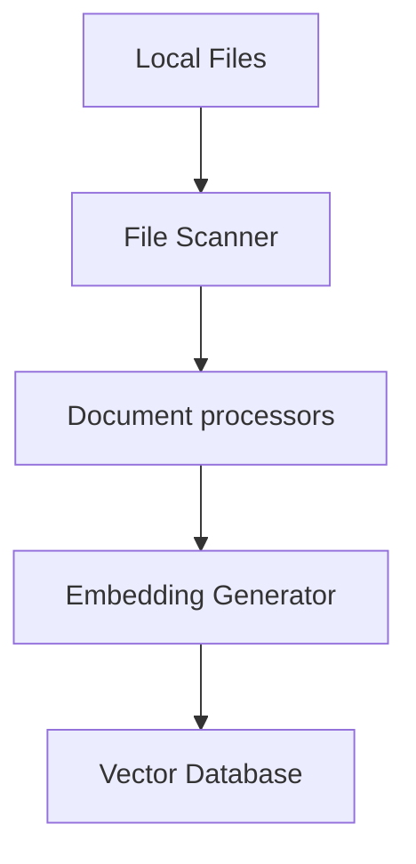

**Navigation:**

- Parent:: [System Documentation](../README.md)
- Peer:: [Implementation Guide](./implementation.md)
- Child:: [Component Details](./components.md)

# File Embedding System Architecture Document

## Table of Contents

1. [System Overview](#1-system-overview)
   - [Purpose](#11-purpose)
   - [Key Features](#12-key-features)
2. [System Architecture](#2-system-architecture)
   - [High-Level Components](#21-high-level-components)
   - [Component Details](#22-component-details)
   - [Data Flow](#23-data-flow)
3. [Technical Specifications](#3-technical-specifications)
   - [System Requirements](#31-system-requirements)
   - [Configuration and Main Modules](#32-configuration-and-main-modules)
   - [API Specifications](#33-api-specifications)
4. [Implementation Strategy](#4-implementation-strategy)
5. [Dependencies](#5-dependencies)
6. [Command Line Interface](#6-command-line-interface)

## 1. System Overview

### 1.1 Purpose
The File Embedding System is designed to process local files and generate vector embeddings using Google Gemini's model, storing these embeddings in a vector database for future use. The system focuses solely on efficient file processing, embedding generation, and vector storage.

### 1.2 Key Features
- Local file processing and embedding generation
- Vector database storage
- Support for multiple file formats
- Efficient batch processing
- Comprehensive metadata tracking

## 2. System Architecture

### 2.1 High-Level Components



### 2.2 Component Details

#### 2.2.1 File Scanner

- **Purpose**: Handles discovery of local files and selection of appropriate Document Processor
- **Key Functions**:
  - Exclusion and inclusion of identified files anddirectories using gitignore notation
  - Generation of SHA256 hash of file for comparison and for the Document Processors
  - Exclusion of existing files that have already been processed
  - File format detection, for example
    - ASCII based file types
      - TXT
      - MD
      - CSV
    - Binary based file types vs PDFs vs images, etc)
      - PDF
      - Image files
  - Selection of appropriate Document Processor (ie use the Markdown Document Processor for MD files)
- **Technologies**:
  - Python

#### 2.2.2 Document Processors

- **Purpose**: Handles ingestion and preprocessing of local files of specific filetypes
- **Key Functions**:
  - Text extraction and normalization from the designated filetype
  - Content chunking for optimal processing
  - Metadata extraction:
    - File metadata (creation time, modification time, filename, path, etc)
    - Document filetype specific information and relationships (ie hashtags, internal links, topics, etc)
- **Technologies**:
  - Python
  - Custom chunking algorithms

#### 2.2.1.1 Document Metadata

- **File Metadata**:
  - `path`: Absolute file path
  - `relative_path`: Path relative to workspace root
  - `directory`: Full directory hierarchy
  - `filename_full`: Descriptive filename with extension
  - `filename_stem`: Descriptive filename without extension
  - `file_type`: Document format/extension
  - `created_at`: Creation timestamp
  - `last_modified`: Last modification timestamp
  - `chunk_count`: Number of text chunks
  - `total_tokens`: Total token count
  - `checksum`: SHA256 hash of the file

#### 2.2.1.2 Vision Document Processor (vision_processor.py)
- **Purpose**: Processes image files using Google Cloud Vision API to extract visual information and prepare it for embedding generation

- **Input**:
  - Image files in supported formats (PNG, JPEG, GIF, BMP, WEBP)
  - Configuration settings from config.DOCUMENT_PROCESSING.VISION_PROCESSOR:
    - API version and credentials
    - Enabled feature types
    - Batch processing parameters
    - Performance settings

- **Output**:
  - Structured image analysis results including:
    - OCR text extraction
    - Object detection and localization
    - Label detection and classification
    - Face detection results
    - Safe search annotations
    - Image properties (color, quality, etc.)
  - Processed metadata:
    - Image dimensions and format
    - Processing timestamp
    - Feature detection confidence scores
    - Error states and warnings

- **Key Functions**:
  - `process_image`: Main entry point for image processing
    - Validates image format and size
    - Prepares API requests
    - Handles response parsing
  - `extract_text`: OCR processing for text in images
    - Full text extraction
    - Text block localization
    - Language detection
  - `detect_objects`: Object detection and analysis
    - Object classification
    - Bounding box coordinates
    - Confidence scores
  - `analyze_faces`: Face detection and analysis
    - Facial feature detection
    - Emotion classification
    - Pose estimation
  - `get_labels`: Image classification and labeling
    - General image labels
    - Topical categorization
    - Web entity matching
  - `check_safe_search`: Content safety analysis
    - Adult content detection
    - Violence detection
    - Medical content detection
  - `extract_properties`: Image property analysis
    - Dominant colors
    - Image quality metrics
    - Metadata extraction

- **Integration Points**:
  - Input: Receives image files from Document Loader
  - Output: Sends processed results to Embedding Generator
  - External: Interfaces with Google Cloud Vision API
  - Logging: Uses logging_setup.py for operation tracking

- **Configuration Example**:
```yaml
DOCUMENT_PROCESSING:
  VISION_PROCESSOR:
    ENABLED: true
    API_VERSION: "v1"
    FEATURES:
      - LABEL_DETECTION
      - TEXT_DETECTION
      - OBJECT_LOCALIZATION
      - FACE_DETECTION
      - SAFE_SEARCH_DETECTION
    MAX_RESULTS: 50
    BATCH_SIZE: 16
    CONCURRENT_REQUESTS: 4
    RETRY_ATTEMPTS: 3
    RETRY_DELAY: 1.0
```

- **Usage Example**:
```python
from embed_files.vision_processor import VisionDocumentProcessor
from embed_files.config import get_config

# Initialize processor
config = get_config()
processor = VisionDocumentProcessor(config)

# Process single image
image_path = "path/to/image.jpg"
results = processor.process_image(image_path)

# Batch process multiple images
image_paths = ["image1.jpg", "image2.png", "image3.webp"]
batch_results = processor.process_batch(image_paths)

# Extract specific features
text_content = processor.extract_text(image_path)
objects = processor.detect_objects(image_path)
labels = processor.get_labels(image_path)
```

#### 2.2.2 Embedding Generator

- **Purpose**: Generates vector embeddings for document chunks and processed image data using Google's models
- **Input**:
  - Document chunks and metadata from Document Processors
  - Processed image data and analysis results from Vision Document Processor
  - Configuration settings (from config.EMBEDDING_MODEL):
    - `MODEL_NAME`: Name of Gemini model to use
    - `BATCH_SIZE`: Number of chunks to process in each batch
    - `MAX_LENGTH`: Maximum text length per chunk
    - `DIMENSIONS`: Output embedding dimensions
- **Output**:
  - Vector embeddings for each chunk
  - Image embeddings incorporating both visual and textual features
  - Updated metadata including:
    - `embedding_model`: Model used for generation
    - `embedding_timestamp`: When embeddings were generated
    - `embedding_dimensions`: Size of generated vectors
    - `chunk_embeddings`: List of generated embeddings
    - `embedding_status`: Success/failure status per chunk

- **Key Functions**:
  - `generate_embeddings`: Main entry point for embedding generation
    - Handles batching of chunks
    - Manages concurrent processing
    - Implements retry logic
  - `generate_image_embeddings`: Specialized handling for processed image data
    - Takes pre-processed image data and Vision API analysis results
    - Generates multimodal embeddings combining visual and textual features
  - `validate_embeddings`: Ensures generated embeddings meet requirements
    - Checks dimensions
    - Validates vector values
    - Verifies completeness
  - `prepare_for_vector_store`: Formats embeddings and metadata for storage
    - Structures data for vector store requirements
    - Adds necessary indexing information
    - Prepares batch operations

- **Integration Points**:
  - Receives processed chunks from Document Processors
  - Receives processed image data from Vision Document Processor
  - Uses logging_setup.py for operation tracking:
    - INFO: Batch processing progress
    - DEBUG: Individual chunk processing details
    - ERROR: Generation or validation failures
  - Outputs directly to Vector Store component

- **Usage**:
```python
from embed_files.embedding_system import EmbeddingGenerator
from embed_files.config import get_config
from embed_files.logging_setup import setup_logging

# Initialize with configuration
config = get_config()
setup_logging(
    log_file=config.get_nested('LOGGING.LOG_FILE'),
    log_level=config.get_nested('LOGGING.LEVEL', "INFO"),
    enable_debug=config.get_nested('LOGGING.DEBUG', False)
)

# Create generator instance
generator = EmbeddingGenerator(config)

# Process chunks from a document
document_chunks = processor.get_chunks()
embeddings = generator.generate_embeddings(
    chunks=document_chunks,
    metadata=document_metadata
)

# Process image data
image_embeddings = generator.generate_image_embeddings(
    processed_image_data=vision_processor_output,
    metadata=image_metadata
)

# Store in vector database
vector_store.add_embeddings(embeddings)
```

Configuration Example (config.yaml):
```yaml
EMBEDDING_MODEL:
  MODEL_NAME: "models/text-embedding-004"
  BATCH_SIZE: 50
  MAX_LENGTH: 2048
  DIMENSIONS: 768
  RETRY_ATTEMPTS: 3
  RETRY_DELAY: 1.0
  CONCURRENT_TASKS: 4
```

#### 2.2.3 Vector Database

- **Purpose**: Stores and indexes document embeddings
- **Key Functions**:
  - Efficient vector storage
  - Metadata management
  - Index optimization
- **Technologies**:
  - Chroma DB

### 2.3 Data Flow

#### 2.3.1 Document Processing Flow

1. System receives configuration path and the file paths to process
2. File Scanner
  - includes files that are explicitly identified
  - skips files identified as to be excluded
  - skips files that have already been processed
3. Document Processors
  - validates and processes files
  - Extracts text content
  - Generates metadata
  - Chunks content for optimal processing
4. Embedding Generator creates vectors for each chunk
5. Vectors and metadata are stored in Vector Database

## 3. Technical Specifications

### 3.1 System Requirements

- **Hardware**:
  - Minimum 32GB RAM
  - Multi-core processor
  - SSD storage for vector database
- **Software**:
  - Python 3.13+
  - Vector database system
  - Google Cloud SDK
  - Google Vision API

### 3.2 Configuration and Main Modules

#### 3.2.1 Main Module (__main__.py)

- **Purpose**: Command-line interface and entry point
- **Input Arguments**:
  - `--add`: Path to process (can be a directory or individual file)
  - `--config`: Path to configuration file (default: './config/config.yaml')
  - `--debug`: Flag to enable debug logging
- **Output**:
  - Exit code 0: Successful execution
  - Exit code 1: Error occurred
  - Console output for progress and errors
  - Log file entries
- **Usage**:
```bash
# Process a directory with default config
python -m embed_files --add /path/to/docs

# Process a single file with custom config
python -m embed_files --add /path/to/docs/specific_file.md --config custom_config.yaml

# Process multiple inputs with debug enabled
python -m embed_files --add /path/to/docs/file1.md --add /path/to/docs/file2.pdf --debug
```

#### 3.2.2 Configuration Module (config.py)

- **Purpose**: Manages system configuration loading and access
- **Input**:
  - Configuration file path (optional, defaults to './config/config.yaml')
  - Environment variables with 'QA_' prefix
- **Output**: Config object with sections:
  - `LOGGING`: Logging settings
    - `LEVEL`: Log level setting
    - `LOG_FILE`: Path to log file
  - `SECURITY`: Security-related settings
  - `FILE_SCANNER`: File scanning settings
    - `ALLOWED_EXTENSIONS`: List of file extensions to process
    - `EXCLUDE_PATTERNS`: List of patterns to exclude
    - `HASH_ALGORITHM`: Hash algorithm for checksums (default: 'sha256')
    - `DOCUMENT_PATH`: Default path for documents to be processed
  - `DOCUMENT_PROCESSING`: Document processing settings
    - `MAX_CHUNK_SIZE`: Maximum size of text chunks
    - `CHUNK_OVERLAP`: Overlap between chunks
    - `CONCURRENT_TASKS`: Number of parallel tasks
    - `BATCH_SIZE`: Documents per batch
  - `EMBEDDING_MODEL`: Model configuration
    - `MODEL_NAME`: Name of Gemini model
    - `BATCH_SIZE`: Embedding batch size
    - `MAX_LENGTH`: Maximum text length
    - `DIMENSIONS`: Output dimensions
  - `VECTOR_STORE`: Vector database configuration
    - `TYPE`: Vector store implementation
    - `PERSIST_DIRECTORY`: Data storage location
    - `COLLECTION_NAME`: Name of collection
    - `DISTANCE_METRIC`: Similarity metric
    - `TOP_K`: Number of results to retrieve
- **Usage**:
```python
from embed_files.config import get_config

# Load with default config path
config = get_config()

# Load with specific config path
config = get_config("./my_config.yaml")

# Access configuration sections
vector_store_config = config.get_nested('VECTOR_STORE')
```

#### 3.2.3 Logging Setup (logging_setup.py)
- **Purpose**: Provides centralized logging configuration with support for file and console output, log rotation, and debug level control
- **Input**:
  - `LOG_FILE`: Path to the log file (from config.LOGGING.LOG_FILE)
  - `LOG_LEVEL`: Logging level (from config.LOGGING.LEVEL, default: "INFO")
  - `DEBUG`: Flag to enable debug logging (default: False)
- **Output**:
  - Configured root logger with both file and console handlers
  - Rotating log files with specified size limits and backup counts
  - Formatted log messages with timestamp, logger name, level, and message
- **Usage**:
```python
from embed_files.config import get_config
from embed_files.logging_setup import setup_logging

# Load configuration
config = get_config()

# Setup logging using configuration values
setup_logging(
    LOG_FILE=config.get_nested('LOGGING.LOG_FILE'),
    LOG_LEVEL=config.get_nested('LOGGING.LEVEL', default="INFO"),
    DEBUG=config.get_nested('LOGGING.DEBUG', default=False)
)
```

Key Features:
- Configuration-driven setup
- Automatic log directory creation
- Log rotation to manage file sizes
- Consistent log formatting across handlers
- Debug mode support
- Console output for immediate feedback
- Thread-safe logging implementation

Log Format:
```
YYYY-MM-DD HH:MM:SS - logger_name - LEVEL - Message
```

Example Log Entry:
```
2024-03-20 14:30:45 - embed_files.document_processor - INFO - Processing document: example.pdf
```

#### 3.2.4 File Scanner (file_scanner.py)
- **Purpose**: Discovers and validates files for processing, manages file selection based on configuration, and generates file checksums
- **Integration with Main**:
  - Receives paths from main's --add argument (supports both directories and individual files)
  - Receives configuration either from default or main's --config argument
- **Input**:
  - `path`: Path to scan (can be a directory or individual file, provided by main's --add argument)
  - Configuration settings (from config.FILE_SCANNER, loaded by main):
    - `EXCLUDE_PATTERNS`: List of gitignore-style patterns for file exclusion/inclusion
      - Permits all files by default
      - Supports standard gitignore pattern syntax
      - Use `!` prefix to explicitly include files that would otherwise be excluded
      - Example: `!README.md` ensures README.md is processed even if `.md` files are excluded
    - `HASH_ALGORITHM`: Hash algorithm for checksums (default: 'sha256')
    - `ALLOWED_EXTENSIONS`: List of file extensions to process
    - `DOCUMENT_PATH`: Default path for documents to be processed
- **Output**:
  - List of dictionaries containing:
    - `path`: Relative path of each file
    - `checksum`: File's cryptographic hash
- **Key Functions**:
  - `should_process_file`: Validates files against configured patterns
  - `calculate_checksum`: Generates cryptographic hashes using configured algorithm
  - `scan_files`: Processes individual files or recursively discovers files in directories
- **Logging Integration**:
  - Uses module-level logger for operation tracking
  - Log levels:
    - INFO: File processing progress
    - DEBUG: Detailed file validation decisions
    - ERROR: File access or processing failures
- **Usage**:
```python
from embed_files.file_scanner import FileScanner

# Initialize with config loaded by main
scanner = FileScanner(config)

# Scan a directory
files = scanner.scan_files("/path/to/directory")

# Process a single file
files = scanner.scan_files("/path/to/specific_file.md")

# Process multiple inputs
files = scanner.scan_files(["/path/to/file1.md", "/path/to/directory", "/path/to/file2.pdf"])
```

Configuration Example (config.yaml):
```yaml
FILE_SCANNER:
  ALLOWED_EXTENSIONS:
    - "txt"
    - "md"
    - "pdf"
    - "jpg"
  EXCLUDE_PATTERNS:
    - "!README.md"
    - "!ARCHITECTURE.md"
    - "!docs/*.md"
    - ".*"  # Hidden files and directories
    - "Excalidraw/"
    - "smart-chats/"
  HASH_ALGORITHM: "sha256"
  DOCUMENT_PATH: "./docs"
```

#### 3.2.5 Document Processors

##### 3.2.5.1 Overview
- **Purpose**: Handles the processing and extraction of content from specific file types, providing a consistent interface for text extraction, metadata generation, and content chunking across different document formats.

##### 3.2.5.2 Core Components

###### Base Document Processor
- **Module**: `base_processor.py`
- **Responsibilities**:
  - Defines common interface for all document processors
  - Provides logging setup
  - Implements shared utility functions
  - Requires implementation of `process()` method by subclasses
  - Implements sentence-aware text chunking to preserve sentence boundaries

###### Supported Processors
1. **PDF Processor** (`pdf_processor.py`):
   - Text extraction with page preservation
   - Header pattern recognition
   - Intelligent chunking based on section boundaries and sentence preservation
   - PDF-specific metadata extraction
   - Token counting using tiktoken

2. **Text Processor** (`text_processor.py`):
   - Plain text file processing
   - Sentence-aware chunking
   - Basic metadata extraction
   
3. **Markdown Processor** (`markdown_processor.py`):
   - Markdown document processing
   - Sentence-aware chunking with markdown structure preservation
   - Basic metadata extraction
   
4. **CSV Processor** (`csv_processor.py`):
   - CSV file processing
   - Row-based chunking with header preservation
   - Basic metadata extraction
   
5. **Vision Document Processor** (`vision_processor.py`):
   - Support for multiple image formats (jpg, jpeg, png, gif, bmp, webp)
   - Integration with Google Vision API for image analysis
   - Extracts and processes:
     - Labels and objects detected in the image
     - Text content through OCR
     - Face detection (if enabled)
     - Safe search annotations
   - Generates image metadata including:
     - Image dimensions and format
     - Color profile information
     - Vision API analysis results
   - Passes both the processed image data and Vision API results to the Embedding Generator
   - Technologies:
     - Google Cloud Vision API
     - Pillow/PIL for image handling
     - Python async for concurrent API calls

##### 3.2.5.3 Interface Specification

###### Input Parameters
- `file_path`: Path to the document to process
- `metadata`: Initial metadata dictionary containing:
  - `path`: Absolute file path
  - `file_type`: Document format/extension
  - `filename`: Name of the file
  - `checksum`: SHA256 hash of the file (provided by File Scanner)

###### Output Format
- **Metadata Dictionary**:
  - All input metadata fields
  - Processing timestamp
  - Processor type used
  - Chunk information (if applicable)
  - Document-specific metadata (varies by processor)

##### 3.2.5.4 Configuration
```yaml
DOCUMENT_PROCESSING:
  MAX_CHUNK_SIZE: 1500     # Maximum size of text chunks
  CHUNK_OVERLAP: 300       # Overlap between chunks
  CONCURRENT_TASKS: 6      # Number of parallel tasks
  BATCH_SIZE: 50          # Documents per batch
  PRESERVE_SENTENCES: true # Ensure chunks don't break sentences
  MIN_CHUNK_SIZE: 100     # Minimum chunk size to prevent tiny chunks
  
  # Header pattern recognition settings for PDF processing
  PDF_HEADER_RECOGNITION:
    ENABLED: true         # Enable header pattern recognition
    MIN_FONT_SIZE: 12     # Minimum font size to consider as header
    PATTERNS:             # Regular expressions for header detection
      - "^[A-Z][^.]*$"   # Uppercase starting lines without periods
      - "^[\d\.]+\s.*$"  # Numbered sections (e.g., "1.2 Section Title")
      - "^Chapter\s+\d+"  # Chapter headings
    MAX_HEADER_LENGTH: 100  # Maximum length for a header line
```

##### 3.2.5.5 Integration

###### File Scanner Integration
- Scanner maintains extension-to-processor mapping
- Automatically selects processor based on file extension
- Provides initial metadata to processor
- Handles processor initialization and error handling

###### Usage Example
```python
from embed_files.document_processors import PDFDocumentProcessor

# Initialize processor
processor = PDFDocumentProcessor()

# Process document
metadata = {
    "path": "/path/to/document.pdf",
    "file_type": "pdf",
    "filename": "document.pdf"
}
processed_metadata = processor.process("/path/to/document.pdf", metadata)
```

##### 3.2.5.6 Error Handling
- Each processor implements specific error handling
- Errors are logged with appropriate context
- Processing continues despite individual failures
- Failed documents are tracked in metadata

##### 3.2.5.7 Extensibility
- New processors can be added by:
  1. Creating new class inheriting from `BaseDocumentProcessor`
  2. Implementing required `process()` method
  3. Adding mapping in `FileScanner.DEFAULT_PROCESSOR_MAP`
  4. Updating configuration if needed

##### 3.2.5.8 Future Enhancements
- Support for additional file formats (docx, rtf, html, ppt)
- Enhanced metadata extraction
- Improved chunking strategies
- OCR integration for images
- Language detection and handling

#### 3.2.6 Embedding Generator (embedding_system.py)
- **Purpose**: Generates vector embeddings for document chunks and images using Google's models
- **Input**:
  - Document chunks and metadata from Document Processors
  - Raw image data and Vision API analysis from Vision Document Processor
  - Configuration settings (from config.EMBEDDING_MODEL):
    - `MODEL_NAME`: Name of Gemini model to use
    - `BATCH_SIZE`: Number of chunks to process in each batch
    - `MAX_LENGTH`: Maximum text length per chunk
    - `DIMENSIONS`: Output embedding dimensions
- **Output**:
  - Vector embeddings for each chunk
  - Image embeddings incorporating both visual and textual features
  - Updated metadata including:
    - `embedding_model`: Model used for generation
    - `embedding_timestamp`: When embeddings were generated
    - `embedding_dimensions`: Size of generated vectors
    - `chunk_embeddings`: List of generated embeddings
    - `embedding_status`: Success/failure status per chunk

- **Key Functions**:
  - `generate_embeddings`: Main entry point for embedding generation
    - Handles batching of chunks
    - Manages concurrent processing
    - Implements retry logic
  - `generate_image_embeddings`: Specialized handling for image data
    - Processes raw image data
    - Incorporates Vision API analysis results
    - Generates multimodal embeddings
  - `validate_embeddings`: Ensures generated embeddings meet requirements
    - Checks dimensions
    - Validates vector values
    - Verifies completeness
  - `prepare_for_vector_store`: Formats embeddings and metadata for storage
    - Structures data for vector store requirements
    - Adds necessary indexing information
    - Prepares batch operations

- **Integration Points**:
  - Receives processed chunks from Document Processors
  - Uses logging_setup.py for operation tracking:
    - INFO: Batch processing progress
    - DEBUG: Individual chunk processing details
    - ERROR: Generation or validation failures
  - Outputs directly to Vector Store component

- **Usage**:
```python
from embed_files.embedding_system import EmbeddingGenerator
from embed_files.config import get_config
from embed_files.logging_setup import setup_logging

# Initialize with configuration
config = get_config()
setup_logging(
    log_file=config.get_nested('LOGGING.LOG_FILE'),
    log_level=config.get_nested('LOGGING.LEVEL', "INFO"),
    enable_debug=config.get_nested('LOGGING.DEBUG', False)
)

# Create generator instance
generator = EmbeddingGenerator(config)

# Process chunks from a document
document_chunks = processor.get_chunks()
embeddings = generator.generate_embeddings(
    chunks=document_chunks,
    metadata=document_metadata
)

# Store in vector database
vector_store.add_embeddings(embeddings)
```

Configuration Example (config.yaml):
```yaml
EMBEDDING_MODEL:
  MODEL_NAME: "models/embedding-001"
  BATCH_SIZE: 50
  MAX_LENGTH: 2048
  DIMENSIONS: 768
  RETRY_ATTEMPTS: 3
  RETRY_DELAY: 1.0
  CONCURRENT_TASKS: 4
```

#### 3.2.6 Vector DB (vector_system.py)
- **Purpose**:
- **Input**:
- **Output**:
- **Usage**:

## 4. Implementation Strategy

### 4.1 Phase 1: Core Infrastructure
- Set up development environment
- Implement shell script that will setup and run the application
- Implement main
  - Integrate logging
- Implement basic file scanner
  - Integrate logging
- Implement basic document processors for each filetype
  - Integrate logging
- Implement basic embedding generation
  - Integrate logging
- Set up vector database

### 4.2 Phase 2: Feature expansion
- Implement more advanced features not implemented in Phase 1

### 4.3 Phase 3: Optimization
- Add batch processing
- Implement caching
- Optimize storage
- Performance tuning
