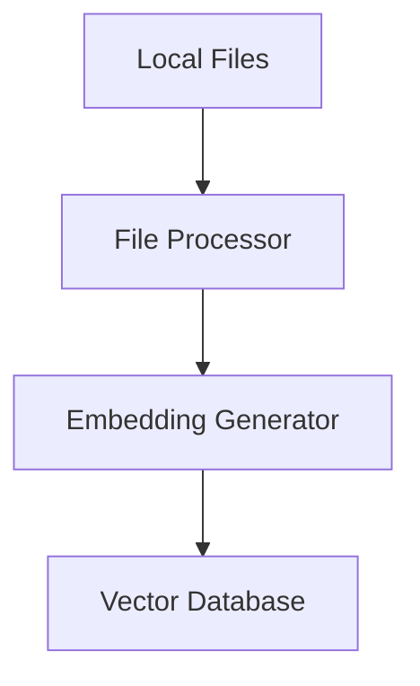

**Navigation:**

- Parent:: [System Documentation](../README.md)
- Peer:: [Implementation Guide](./implementation.md)
- Child:: [Component Details](./components.md)

# File Embedding System Architecture Document

## Table of Contents

1. [System Overview](#1-system-overview)
   - [Purpose](#11-purpose)
   - [Key Features](#12-key-features)
2. [System Architecture](#2-system-architecture)
   - [High-Level Components](#21-high-level-components)
   - [Component Details](#22-component-details)
   - [Data Flow](#23-data-flow)
3. [Technical Specifications](#3-technical-specifications)
   - [System Requirements](#31-system-requirements)
   - [API Specifications](#32-api-specifications)
4. [Implementation Strategy](#4-implementation-strategy)
5. [Dependencies](#5-dependencies)
6. [Command Line Interface](#6-command-line-interface)

## 1. System Overview

### 1.1 Purpose
The File Embedding System is designed to process local files and generate vector embeddings using Google Gemini's model, storing these embeddings in a vector database for future use. The system focuses solely on efficient file processing, embedding generation, and vector storage.

### 1.2 Key Features
- Local file processing and embedding generation
- Vector database storage
- Support for multiple file formats
- Efficient batch processing
- Comprehensive metadata tracking

## 2. System Architecture

### 2.1 High-Level Components



### 2.2 Component Details

#### 2.2.1 File Processor

- **Purpose**: Handles ingestion and preprocessing of local files
- **Key Functions**:
  - File format detection and validation (ie ascii based file types vs PDFs vs images, etc)
  - Text extraction from various formats (PDF, DOCX, TXT, MD, CSV, YAML, etc.)
  - Content chunking for optimal processing
  - Metadata extraction:
    - Directory structure context
    - File metadata (creation time, modification time, filename)
    - Document relationships (ie hashtags, internal links, topics, etc)
- **Technologies**:
  - Python with specialized libraries (PyPDF2, python-docx)
  - Custom chunking algorithms
  - YAML parser for frontmatter

#### 2.2.1.1 Document Metadata

- **Core Metadata**:
  - `path`: Absolute file path
  - `relative_path`: Path relative to workspace root
  - `directory`: Full directory hierarchy
  - `filename_full`: Descriptive filename with extension
  - `filename_stem`: Descriptive filename without extension
  - `file_type`: Document format/extension
  - `created_at`: Creation timestamp
  - `last_modified`: Last modification timestamp
  - `chunk_count`: Number of text chunks
  - `total_tokens`: Total token count
  - `checksum`: SHA256 hash of the file

#### 2.2.2 Embedding Generator

- **Purpose**: Creates vector embeddings for document chunks
- **Key Functions**:
  - Text normalization
  - Embedding generation using Google's embedding models
  - Batch processing for efficiency
  - Embedding validation and error handling
- **Technologies**:
  - Google's Embedding API
  - NumPy for vector operations
  - Batch processing queue

#### 2.2.3 Vector Database

- **Purpose**: Stores and indexes document embeddings
- **Key Functions**:
  - Efficient vector storage
  - Metadata management
  - Index optimization
- **Technologies**:
  - Chroma DB

### 2.3 Data Flow

#### 2.3.1 Document Processing Flow

1. System receives file paths to process
  - includes files that are explicitly identified
  - skips files identified as to be excluded
  - skips files that have already been processed
2. File Processor validates and processes files:
   - Extracts text content
   - Generates metadata
   - Chunks content for optimal processing
3. Embedding Generator creates vectors for each chunk
4. Vectors and metadata are stored in Vector Database

## 3. Technical Specifications

### 3.1 System Requirements

- **Hardware**:
  - Minimum 16GB RAM
  - Multi-core processor
  - SSD storage for vector database
- **Software**:
  - Python 3.12+
  - Vector database system
  - Google Cloud SDK

### 3.2 API Specifications

```python
# Core API Interfaces

class DocumentProcessor:
    async def process_document(self, file_path: str) -> DocumentMetadata:
        """Process a document and generate embeddings."""
        pass

class VectorStore:
    async def store_embeddings(self, embeddings: List[Vector], metadata: DocumentMetadata):
        """Store document embeddings and metadata."""
        pass
```

## 4. Implementation Strategy

### 4.1 Phase 1: Core Infrastructure
- Set up development environment
- Implement basic file processing
- Integrate embedding generation
- Set up vector database

### 4.2 Phase 2: Optimization
- Add batch processing
- Implement caching
- Optimize storage
- Add monitoring and logging
- Performance tuning

## 5. Dependencies

### 5.1 External Services
- Google Gemini API

### 5.2 Libraries and Frameworks
- chromadb for vector storage
- pydantic for data validation
- pytest for testing

## 6. Command Line Interface

```bash
# Show help message
embed_files --help

# Process files and generate embeddings
embed_files /path/to/files/* --batch-size 10

# List processed files
embed_files --list

# Remove files from vector DB
embed_files --remove /path/to/file

# Show processing status
embed_files --status
``` 