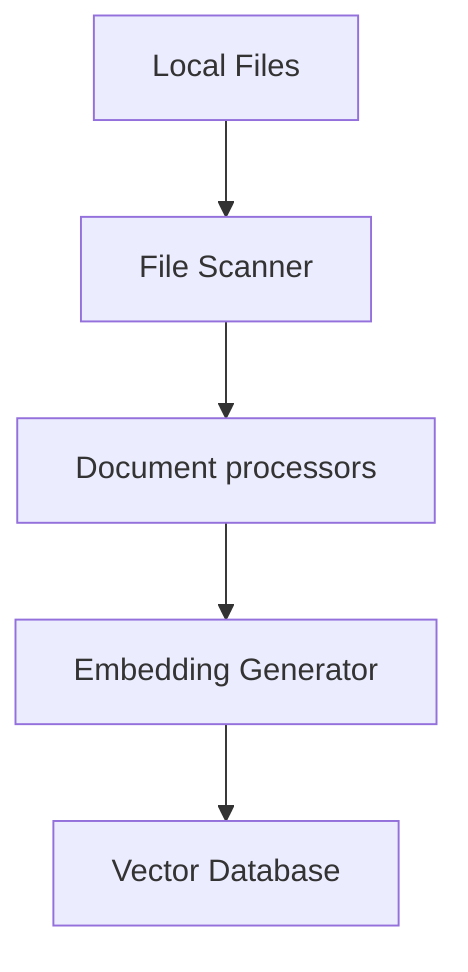

**Navigation:**

- Parent:: [System Documentation](../README.md)
- Peer:: [Implementation Guide](./implementation.md)
- Child:: [Component Details](./components.md)

# File Embedding System Architecture Document

## Table of Contents

1. [System Overview](#1-system-overview)
   - [Purpose](#11-purpose)
   - [Key Features](#12-key-features)
2. [System Architecture](#2-system-architecture)
   - [High-Level Components](#21-high-level-components)
   - [Component Details](#22-component-details)
   - [Data Flow](#23-data-flow)
3. [Technical Specifications](#3-technical-specifications)
   - [System Requirements](#31-system-requirements)
   - [Configuration and Main Modules](#32-configuration-and-main-modules)
   - [API Specifications](#33-api-specifications)
4. [Implementation Strategy](#4-implementation-strategy)
5. [Dependencies](#5-dependencies)
6. [Command Line Interface](#6-command-line-interface)

## 1. System Overview

### 1.1 Purpose
The File Embedding System is designed to process local files and generate vector embeddings using Google Gemini's model, storing these embeddings in a vector database for future use. The system focuses solely on efficient file processing, embedding generation, and vector storage.

### 1.2 Key Features
- Local file processing and embedding generation
- Vector database storage
- Support for multiple file formats
- Efficient batch processing
- Comprehensive metadata tracking

## 2. System Architecture

### 2.1 High-Level Components



### 2.2 Component Details

#### 2.2.1 File Scanner

- **Purpose**: Handles discovery of local files and selection of appropriate Document Processor
- **Key Functions**:
  - Exclusion and inclusion of identified files anddirectories using gitignore notation
  - Generation of SHA256 hash of file for comparison and for the Document Processors
  - Exclusion of existing files that have already been processed
  - File format detection, for example
    - ASCII based file types
      - TXT
      - MD
      - CSV
    - Binary based file types vs PDFs vs images, etc)
      - PDF
      - Image files
  - Selection of appropriate Document Processor (ie use the Markdown Document Processor for MD files)
- **Technologies**:
  - Python

#### 2.2.2 Document Processors

- **Purpose**: Handles ingestion and preprocessing of local files of specific filetypes
- **Key Functions**:
  - Text extraction and normalization from the designated filetype
  - Content chunking for optimal processing
  - Metadata extraction:
    - File metadata (creation time, modification time, filename, path, etc)
    - Document filetype specific information and relationships (ie hashtags, internal links, topics, etc)
- **Technologies**:
  - Python
  - Custom chunking algorithms

#### 2.2.1.1 Document Metadata

- **File Metadata**:
  - `path`: Absolute file path
  - `relative_path`: Path relative to workspace root
  - `directory`: Full directory hierarchy
  - `filename_full`: Descriptive filename with extension
  - `filename_stem`: Descriptive filename without extension
  - `file_type`: Document format/extension
  - `created_at`: Creation timestamp
  - `last_modified`: Last modification timestamp
  - `chunk_count`: Number of text chunks
  - `total_tokens`: Total token count
  - `checksum`: SHA256 hash of the file

#### 2.2.2 Embedding Generator

- **Purpose**: Creates vector embeddings for document chunks
- **Key Functions**:
  - Embedding generation using Google's embedding models and Vision API
  - Batch processing for efficiency
  - Embedding validation and error handling
- **Technologies**:
  - Google Vision API for images
  - Google's Embedding API for all other files
  - NumPy for vector operations
  - Batch processing queue

#### 2.2.3 Vector Database

- **Purpose**: Stores and indexes document embeddings
- **Key Functions**:
  - Efficient vector storage
  - Metadata management
  - Index optimization
- **Technologies**:
  - Chroma DB

### 2.3 Data Flow

#### 2.3.1 Document Processing Flow

1. System receives configuration path and the file paths to process
2. File Scanner
  - includes files that are explicitly identified
  - skips files identified as to be excluded
  - skips files that have already been processed
3. Document Processors
  - validates and processes files
  - Extracts text content
  - Generates metadata
  - Chunks content for optimal processing
4. Embedding Generator creates vectors for each chunk
5. Vectors and metadata are stored in Vector Database

## 3. Technical Specifications

### 3.1 System Requirements

- **Hardware**:
  - Minimum 32GB RAM
  - Multi-core processor
  - SSD storage for vector database
- **Software**:
  - Python 3.13+
  - Vector database system
  - Google Cloud SDK
  - Google Vision API

### 3.2 Configuration and Main Modules

#### 3.2.1 Main Module (__main__.py)

- **Purpose**: Command-line interface and entry point
- **Input Arguments**:
  - `--add`: Directory path to process documents from
  - `--config`: Path to configuration file (default: './config/config.yaml')
  - `--debug`: Flag to enable debug logging
- **Output**:
  - Exit code 0: Successful execution
  - Exit code 1: Error occurred
  - Console output for progress and errors
  - Log file entries
- **Usage**:
```bash
# Process documents with default config
python -m embed_files --add /path/to/docs

# Use custom config and enable debug
python -m embed_files --add /path/to/docs --config custom_config.yaml --debug
```

#### 3.2.2 Configuration Module (config.py)

- **Purpose**: Manages system configuration loading and access
- **Input**:
  - Configuration file path (optional, defaults to './config/config.yaml')
  - Environment variables with 'QA_' prefix
- **Output**: Config object with sections:
  - `LOGGING`: Logging settings
  - `SECURITY`: Security-related settings
  - `DOCUMENT_PROCESSING`: Document processing settings
  - `EMBEDDING_MODEL`: Model configuration
  
  - `VECTOR_STORE`: Vector database configuration
- **Usage**:
```python
from embed_files.config import get_config

# Load with default config path
config = get_config()

# Load with specific config path
config = get_config("./my_config.yaml")

# Access configuration sections
vector_store_config = config.get_nested('VECTOR_STORE')
```


## 4. Implementation Strategy

### 4.1 Phase 1: Core Infrastructure
- Set up development environment
- Implement shell script that will setup and run the application
- Implement main
  - Integrate logging
- Implement basic file scanner
  - Integrate logging
- Implement basic document processors for each filetype
  - Integrate logging
- Implement basic embedding generation
  - Integrate logging
- Set up vector database

### 4.2 Phase 2: Feature expansion
- Implement more advanced features not implemented in Phase 1

### 4.3 Phase 3: Optimization
- Add batch processing
- Implement caching
- Optimize storage
- Performance tuning
