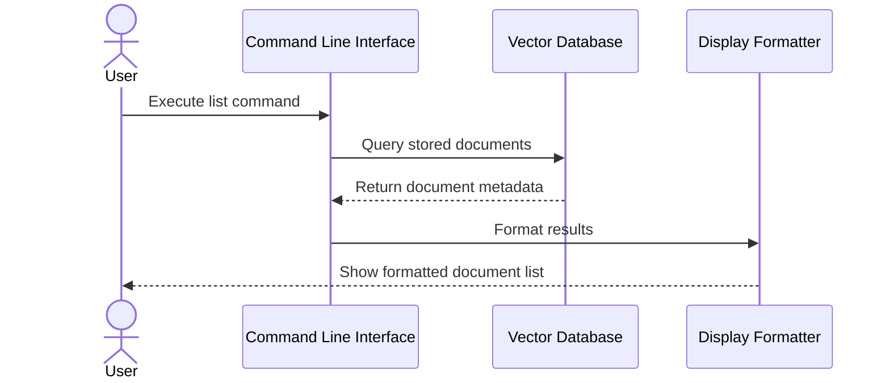
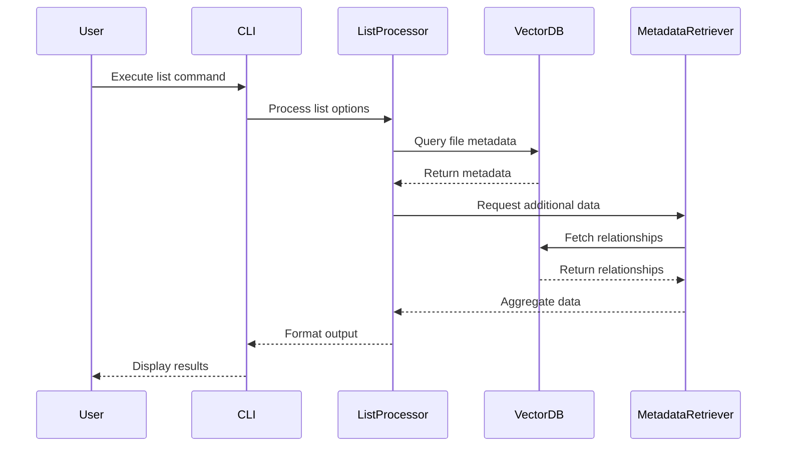

# Listing Flow

The listing flow shows how document information is retrieved:
1. User executes the list command
2. CLI sends query to Vector Database
3. Vector Database returns metadata of stored documents
4. Results are formatted for display
5. Formatted list is shown to user

# List Flow Components

This document details the components specific to the file listing flow in the File Embedding System.

## List Flow Overview

The list flow provides functionality to enumerate and display information about files that have been processed and stored in the system. It allows users to view metadata, statistics, and relationships between files in the vector database.

## Components

### List Command Processor
- **Purpose**: Handles the processing and formatting of list commands from the CLI
- **Key Functions**:
  - Parsing of list command options and filters
  - Query construction for the Vector Database
  - Output formatting and display
- **Technologies**:
  - Python Click for CLI
  - Custom formatting utilities

### Metadata Retriever
- **Purpose**: Fetches and aggregates metadata from the Vector Database
- **Key Functions**:
  - Retrieval of file metadata
  - Collection of embedding statistics
  - Aggregation of relationship data
- **Technologies**:
  - Vector Database client libraries
  - Python data processing utilities

## Output Formats

### Default List Format
- File path (relative to workspace root)
- File type
- Last modified date
- Number of chunks
- Total tokens
- Embedding status

### Detailed List Format
- All default format information
- Creation date
- Absolute path
- Directory structure
- Checksum
- Related files
- Custom metadata based on file type

### JSON Format
- Machine-readable output
- Complete metadata dump
- Relationship graphs
- Statistics and analytics

## List Flow Sequence

