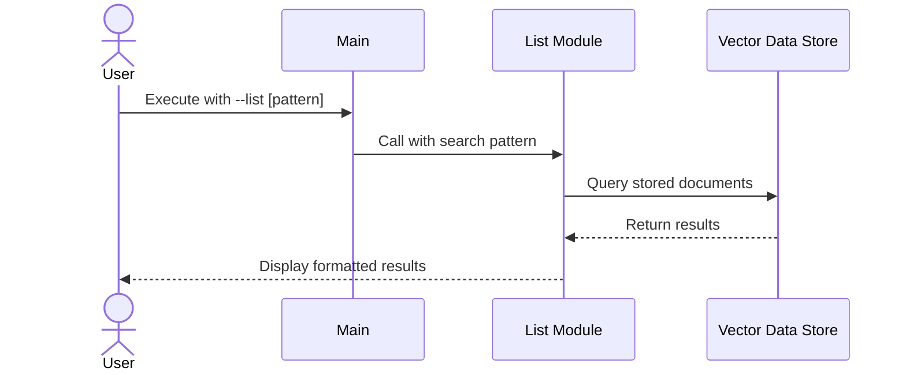

# Listing Flow

## Table of Contents
1. [Overview](#1-overview)
2. [System Flow](#2-system-flow)
3. [Components](#3-components)
   3.1. [List Module](#31-list-module)
      3.1.1. [Output Modes](#311-output-modes)
   3.2. [Vector Store Interface](#32-vector-store-interface)

## 1. Overview
The Listing Flow describes the process of retrieving and displaying document information from the vector database. This flow is initiated through the [Main Module](ARCHITECTURE-common-components.md#2-main-module) using the `--list` command-line argument.

The flow utilizes several common components:
- [Configuration Module](ARCHITECTURE-common-components.md#3-configuration-module): For loading and managing display settings
- [Logging Setup](ARCHITECTURE-common-components.md#4-logging-setup): For consistent logging across all components
- [Vector Database](ARCHITECTURE-common-components.md#5-vector-database): For retrieving document metadata

## 2. System Flow


## 3. Components

### 3.1. List Module
- **Purpose**: Handles the listing of documents stored in the vector database
- **Dependencies**:
  - [Configuration Module](ARCHITECTURE-common-components.md#3-configuration-module) for system settings
  - [Logging Setup](ARCHITECTURE-common-components.md#4-logging-setup) for operation tracking
  - [Vector Database](ARCHITECTURE-common-components.md#5-vector-database) for data retrieval
  - [Exceptions Module](ARCHITECTURE-common-components.md#6-exceptions-module) for error handling
- **Key Functions**:
  - Process search patterns from command line arguments
  - Query vector database for matching documents
  - Format and display results to the user (with output mode switches)
  - Generate basic statistics about the results (in detail mode)

#### 3.1.1 Output Modes

The `--list` command now supports output control switches:

- **Default:** Only the full path for each file (one per line).
- **--detail:** Show a table with columns for path, type, chunk count, and last modified date, plus summary statistics.
- **--summary:** Show the path and a summary (if available) for each file.

**Example usage:**

```bash
./run.sh --list "*.pdf"           # just paths
./run.sh --list "*.pdf" --detail  # table with metadata
./run.sh --list "*.pdf" --summary # path + summary
```

**Example output:**

_Default:_
```
/docs/a.pdf
/docs/b.pdf
```

_With --detail:_
```
Path                                              Type       Chunks   Last Modified      
--------------------------------------------------------------------------------
/docs/a.pdf                                       pdf        12       2024-06-01         
/docs/b.pdf                                       pdf        8        2024-05-30         
...

Total documents: 2
Documents with metadata: 2
Document types: {'pdf': 2}
```

_With --summary:_
```
/docs/a.pdf: This document covers the architecture of the QA system...
/docs/b.pdf: Summary not available.
```

#### 3.1.2 API Usage
```python
# Import the list module
from qa_system.list import get_list_module

# Get configured list module instance
list_module = get_list_module()

# List all documents
results = list_module.list_documents()

# List documents matching a pattern
python_files = list_module.list_documents("**/*.py")

# Get collection statistics
stats = list_module.get_collection_stats()
print(f"Total documents: {stats['total_documents']}")
print(f"Document types: {stats['document_types']}")

# Get just the document count
count = list_module.get_document_count()
print(f"Number of documents: {count}")
```

The List module provides a simple interface for retrieving document information:

- `list_documents(pattern=None)`: Returns list of document metadata
  - `pattern`: Optional glob pattern to filter results (e.g. "*.py", "docs/*.md")
  - Returns: List of dictionaries containing document metadata

- `get_collection_stats()`: Returns statistics about the document collection
  - Returns: Dictionary with collection-level metrics

- `get_document_count()`: Returns total number of documents
  - Returns: Integer count of documents in collection

### 3.2. Vector Store Interface
The List flow uses the [Vector Database](ARCHITECTURE-common-components.md#5-vector-database) component for accessing document metadata. For full details on the vector store implementation, data model, and configuration, see the common components documentation.

List-specific usage focuses on:
- Metadata-only retrieval (no embedding lookup needed)
- Pattern-based document filtering
- Collection statistics and document counts

For the complete vector store interface documentation, including:
- Data model and metadata fields: [Section 5.2](ARCHITECTURE-common-components.md#52-data-model)
- Query operations: [Section 5.3](ARCHITECTURE-common-components.md#53-operations)
- Configuration options: [Section 5.4](ARCHITECTURE-common-components.md#54-configuration)
- Integration examples: [Section 5.5](ARCHITECTURE-common-components.md#55-integration)
