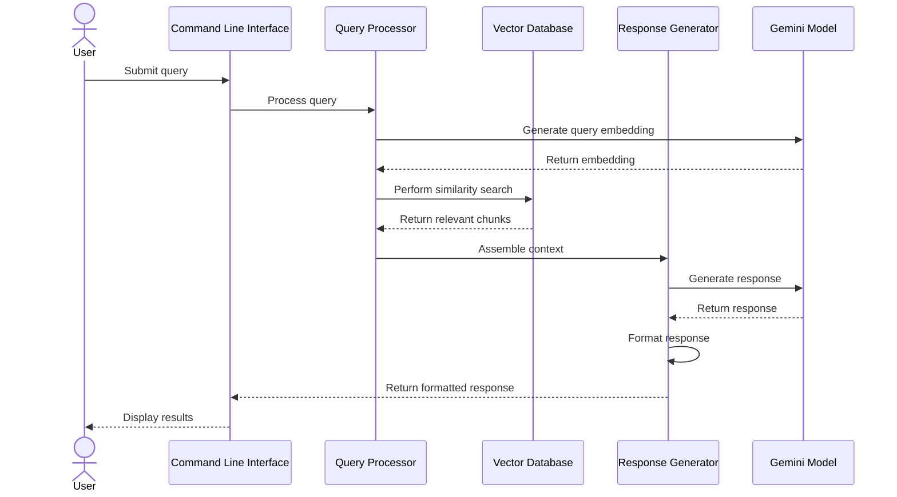

# Table of Contents
1. [Overview](#1-overview)
2. [System Flow](#2-system-flow)
3. [Components](#3-components)
   3.1. [Query Processor](#31-query-processor)
   3.2. [Response Generator](#32-response-generator)
4. [Query Types](#4-query-types)
   4.1. [Basic Query](#41-basic-query)
   4.2. [Advanced Query](#42-advanced-query)
   4.3. [Hybrid Query](#43-hybrid-query)
5. [Configuration](#5-configuration)
6. [Technical Specifications](#6-technical-specifications)
7. [Integration](#7-integration)
8. [Usage](#8-usage)
   8.1. [Command Line Interface](#81-command-line-interface)
   8.2. [Python API Usage](#82-python-api-usage)
   8.3. [Response Object Structure](#83-response-object-structure)
9. [Response Formats](#9-response-formats)
   9.1. [Default Format](#91-default-format)
   9.2. [Detailed Format](#92-detailed-format)

# 1. Overview

The query flow enables semantic search capabilities across processed documents. It converts user queries into vector embeddings, performs similarity searches, and generates contextually relevant responses using the Gemini model.

# 2. System Flow



# 3. Components
Implementation of the Google Gemini AI models are to follow the API guide found here: https://ai.google.dev/gemini-api/docs/text-generation

## 3.1 Query Processor
- **Purpose**: Handles semantic search queries and manages the search process
- **Dependencies**:
  - [Configuration Module](ARCHITECTURE-common-components.md#3-configuration-module) for query settings
  - [Logging Setup](ARCHITECTURE-common-components.md#4-logging-setup) for operation tracking
  - [Vector Database](ARCHITECTURE-common-components.md#5-vector-database) for similarity search
  - [Exceptions Module](ARCHITECTURE-common-components.md#6-exceptions-module) for error handling
- **Key Functions**:
  - Query embedding generation
    - Converts text queries to vector embeddings
    - Normalizes query format
  - Similarity search execution
    - Performs vector similarity calculations
    - Filters results based on metadata
  - Result ranking
    - Scores and ranks search results
    - Applies relevance filtering
  - Context assembly
    - Gathers relevant document chunks
    - Builds context for response generation
- **Technologies**:
  - Vector similarity algorithms
  - Result ranking algorithms

## 3.2 Response Generator
- **Purpose**: Generates contextual responses using retrieved information
- **Dependencies**:
  - [Configuration Module](ARCHITECTURE-common-components.md#3-configuration-module) for response settings
  - [Logging Setup](ARCHITECTURE-common-components.md#4-logging-setup) for operation tracking
  - [Exceptions Module](ARCHITECTURE-common-components.md#6-exceptions-module) for error handling
- **Key Functions**:
  - Context integration
    - Combines retrieved chunks
    - Orders information by relevance
  - Response generation
    - Uses Gemini model for response
    - Ensures factual accuracy
  - Source attribution
    - Links responses to source documents
    - Provides confidence scores
  - Response formatting
    - Structures output for readability
    - Includes relevant metadata
- **Technologies**:
  - Gemini API
  - Rich text formatting

# 4. Query Types

## 4.1 Basic Query
- Simple text query
- Returns most relevant documents
- Basic relevance scoring

## 4.2 Advanced Query
- Supports filters and constraints
- Metadata-based filtering
- Custom ranking options

## 4.3 Hybrid Query
- Combines text and metadata search
- Weighted relevance scoring
- Advanced filtering options

# 5. Configuration

The query flow is configured through several sections in the configuration file:

```yaml
# Embedding Model Configuration
EMBEDDING_MODEL:
  MODEL_NAME: "models/embedding-001"    # Gemini embedding model
  BATCH_SIZE: 15                        # Number of texts to process at once
  MAX_LENGTH: 3072                      # Maximum text length in tokens
  DIMENSIONS: 768                       # Output embedding dimensions

# Vector Database Configuration
VECTOR_STORE:
  TYPE: "chroma"                        # Vector store implementation
  PERSIST_DIRECTORY: "./data/vector_store"  # Data storage location
  COLLECTION_NAME: "qa_documents"       # Collection name
  DISTANCE_METRIC: "cosine"            # Similarity metric
  TOP_K: 40                            # Number of results to retrieve

# Document Processing Configuration
DOCUMENT_PROCESSING:
  MAX_CHUNK_SIZE: 3072                 # Maximum size of text chunks
  MIN_CHUNK_SIZE: 1024                 # Minimum chunk size
  CHUNK_OVERLAP: 768                   # Overlap between chunks
  PRESERVE_SENTENCES: true             # Ensure chunks don't break sentences
  CONCURRENT_TASKS: 6                  # Number of parallel tasks
  BATCH_SIZE: 50                       # Documents per batch

# Security Configuration
SECURITY:
  GOOGLE_APPLICATION_CREDENTIALS: ${GOOGLE_APPLICATION_CREDENTIALS}
  GOOGLE_CLOUD_PROJECT: ${GOOGLE_CLOUD_PROJECT}
```

### Configuration Details

#### Embedding Model
- `MODEL_NAME`: Specifies the Gemini model for embeddings
- `BATCH_SIZE`: Controls batch processing efficiency (10-15 recommended)
- `MAX_LENGTH`: Maximum token length (3072 for text-embedding-004)
- `DIMENSIONS`: Output dimensions (768 or 1024)

#### Vector Store
- `TYPE`: Vector database implementation (ChromaDB)
- `PERSIST_DIRECTORY`: Storage location for vector data
- `COLLECTION_NAME`: Name of the document collection
- `DISTANCE_METRIC`: Similarity calculation method (cosine, euclidean, dot)
- `TOP_K`: Initial retrieval count before relevance scoring

#### Document Processing
- `MAX_CHUNK_SIZE`: Maximum characters per chunk (matches embedding limit)
- `MIN_CHUNK_SIZE`: Minimum chunk size to ensure meaningful content
- `CHUNK_OVERLAP`: Character overlap between chunks
- `PRESERVE_SENTENCES`: Maintains sentence integrity during chunking
- `CONCURRENT_TASKS`: Parallel processing capacity
- `BATCH_SIZE`: Batch processing size for efficiency

#### Security
- `GOOGLE_APPLICATION_CREDENTIALS`: Path to Google Cloud credentials
- `GOOGLE_CLOUD_PROJECT`: Google Cloud project identifier

# 6. Technical Specifications

### System Requirements
- Python 3.13 or higher
- Gemini API access
- Vector database support (ChromaDB)
- Sufficient memory for embedding operations

### Dependencies
- `google-cloud-aiplatform`: Gemini API integration
- `chromadb`: Vector database operations
- `numpy`: Vector operations and calculations
- `pydantic`: Data validation and settings management

### Performance Considerations
- Query processing: < 100ms
- Embedding generation: < 500ms per query
- Vector search: < 200ms for up to 100k documents
- Response generation: < 2s for typical queries

### Error Handling
- Query validation errors
- Embedding generation failures
- Vector search timeouts
- Response generation limits
- Rate limiting and quotas

# 7. Integration

### Common Components Integration
- Uses logging setup from [ARCHITECTURE-common-components.md](ARCHITECTURE-common-components.md)
- Follows configuration patterns defined in common components
- Utilizes shared error handling and monitoring

### Vector Store Integration
- Interfaces with vector database for similarity search
- Maintains consistent metadata format with add/remove flows
- Supports transaction management for query operations

### Security Integration
- Implements authentication and authorization checks
- Manages API keys and credentials securely
- Follows security best practices from common components

# 8. Usage

## 8.1 Command Line Interface
```bash
# Start interactive chat mode
python -m qa_system --query                                 # Enter interactive chat session
python -m qa_system --query --debug                        # Interactive chat with debug logging

# Single query mode
python -m qa_system --query "What is the project about?"    # One-shot query
python -m qa_system --query "Find documents about logging"  # Search specific topics

# With custom configuration
python -m qa_system --query --config custom_config.yaml     # Use custom configuration
```

## 8.2 Python API Usage
```python
from qa_system.query_processor import QueryProcessor
from qa_system.config import get_config
from qa_system.logging_setup import setup_logging

# Initialize components
config = get_config()
setup_logging(
    LOG_FILE=config.get_nested('LOGGING.LOG_FILE'),
    LEVEL=config.get_nested('LOGGING.LEVEL', default="INFO")
)

# Create query processor
processor = QueryProcessor(config)

# Single query mode
query = "What are the main features of the system?"
response = processor.process_query(query)
print(f"Response: {response.text}")
print(f"Sources: {response.sources}")

# Interactive chat session
def chat_session():
    processor = QueryProcessor(config)
    
    try:
        while True:
            query = input("\nEnter your question (or 'exit' to quit): ")
            if query.lower() in ['exit', 'quit']:
                break
                
            response = processor.process_query(query)
            print("\nResponse:", response.text)
            
            if response.sources:
                print("\nSources:")
                for source in response.sources:
                    print(f"- {source.document} (similarity: {source.similarity:.2f})")
    except KeyboardInterrupt:
        print("\nChat session ended.")

# Example response handling
response = processor.process_query("How does the logging system work?")
if response.success:
    print("Answer:", response.text)
    print("\nRelevant documents:")
    for source in response.sources:
        print(f"- {source.document}")
        print(f"  Similarity: {source.similarity:.2f}")
        print(f"  Context: {source.context[:100]}...")
else:
    print("Error:", response.error)
```

## 8.3 Response Object Structure
```python
class QueryResponse:
    text: str                # Generated response text
    sources: List[Source]    # List of source documents used
    confidence: float        # Response confidence score (0.0-1.0)
    processing_time: float   # Time taken to generate response
    error: Optional[str]     # Error message if query failed
    success: bool           # Whether query was successful

class Source:
    document: str           # Source document path
    chunk: str             # Relevant text chunk
    similarity: float      # Similarity score (0.0-1.0)
    context: str           # Surrounding context
    metadata: dict         # Additional document metadata
```

# 9. Response Formats

## 9.1 Default Format
```json
{
  "response": "Generated response text",
  "sources": [
    {
      "document": "document_name.txt",
      "chunk": "Relevant chunk text",
      "similarity": 0.85
    }
  ],
  "metadata": {
    "confidence": 0.92,
    "processing_time": "0.5s"
  }
}
```

## 9.2 Detailed Format
```json
{
  "response": {
    "text": "Generated response text",
    "sections": [
      {
        "content": "Section content",
        "sources": ["doc1.txt", "doc2.pdf"],
        "confidence": 0.95
      }
    ]
  },
  "sources": [
    {
      "document": "document_name.txt",
      "chunk": "Relevant chunk text",
      "similarity": 0.85,
      "metadata": {
        "file_type": "text",
        "last_modified": "2024-03-20",
        "chunk_index": 3
      }
    }
  ],
  "metadata": {
    "confidence": 0.92,
    "processing_time": "0.5s",
    "tokens_used": 450,
    "query_embedding": {
      "dimensions": 768,
      "model": "text-embedding-004"
    }
  }
}
```