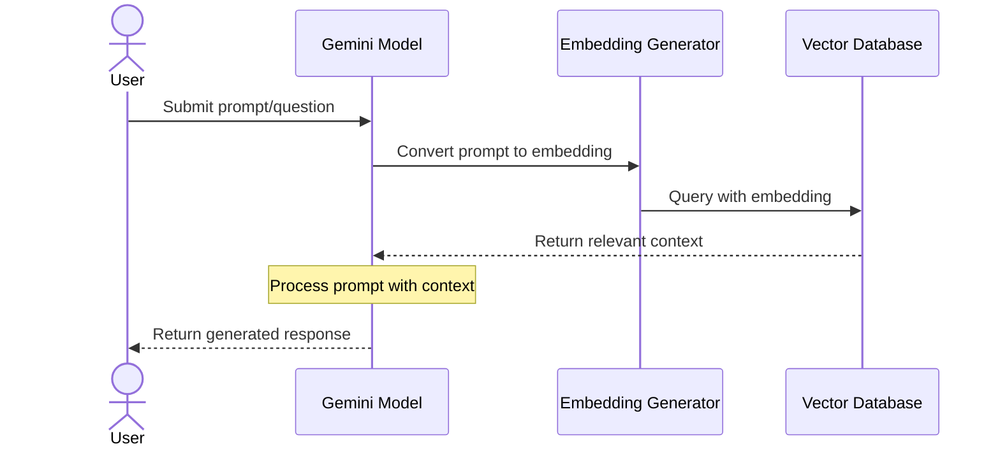

# Querying Flow



The querying flow illustrates how the system processes user prompts:
1. User submits a prompt/question
2. Gemini model receives the prompt and sends it to the Embedding Generator
3. Embedding Generator converts the prompt to embeddings for semantic search
4. Vector database is queried with the embeddings to find relevant context
5. Retrieved context is sent back to Gemini
6. Gemini processes the original prompt with the retrieved context
7. Generated response is returned to the user

# Query Flow Components

This document details the components specific to the query flow in the File Embedding System.

## Query Flow Overview

The query flow enables semantic search capabilities across processed documents. It converts user queries into vector embeddings, performs similarity searches, and generates contextually relevant responses using the Gemini model.

## Components

### Query Processor
- **Purpose**: Handles semantic search queries and manages the search process
- **Key Functions**:
  - Query embedding generation
    - Converts text queries to vector embeddings
    - Normalizes query format
  - Similarity search execution
    - Performs vector similarity calculations
    - Filters results based on metadata
  - Result ranking
    - Scores and ranks search results
    - Applies relevance filtering
  - Context assembly
    - Gathers relevant document chunks
    - Builds context for response generation
- **Technologies**:
  - Vector similarity algorithms
  - Result ranking algorithms

### Response Generator
- **Purpose**: Generates contextual responses using retrieved information
- **Key Functions**:
  - Context integration
    - Combines retrieved chunks
    - Orders information by relevance
  - Response generation
    - Uses Gemini model for response
    - Ensures factual accuracy
  - Source attribution
    - Links responses to source documents
    - Provides confidence scores
  - Response formatting
    - Structures output for readability
    - Includes relevant metadata
- **Technologies**:
  - Gemini API
  - Rich text formatting

## Query Flow Sequence


## Query Types

### Basic Query
- Simple text query
- Returns most relevant documents
- Basic relevance scoring

### Advanced Query
- Supports filters and constraints
- Metadata-based filtering
- Custom ranking options

### Hybrid Query
- Combines text and metadata search
- Weighted relevance scoring
- Advanced filtering options

## Configuration Options

```yaml
QUERY_PROCESSOR:
  MAX_RESULTS: 5          # Maximum number of results to return
  MIN_SIMILARITY: 0.7     # Minimum similarity score threshold
  CONTEXT_WINDOW: 3       # Number of surrounding chunks to include
  
RESPONSE_GENERATOR:
  MAX_TOKENS: 1000        # Maximum response length
  TEMPERATURE: 0.7        # Response creativity (0.0-1.0)
  INCLUDE_SOURCES: true   # Include source document references
  FORMAT_OUTPUT: true     # Apply formatting to response
```

## Response Formats

### Default Format
```json
{
  "response": "Generated response text",
  "sources": [
    {
      "document": "document_name.txt",
      "chunk": "Relevant chunk text",
      "similarity": 0.85
    }
  ],
  "metadata": {
    "confidence": 0.92,
    "processing_time": "0.5s"
  }
}
```

### Detailed Format
```json
{
  "response": {
    "text": "Generated response text",
    "sections": [
      {
        "content": "Section content",
        "sources": ["doc1.txt", "doc2.pdf"],
        "confidence": 0.95
      }
    ]
  },
  "sources": [
    {
      "document": "document_name.txt",
      "chunk": "Relevant chunk text",
      "similarity": 0.85,
      "metadata": {
        "file_type": "text",
        "last_modified": "2024-03-20",
        "chunk_index": 3
      }
    }
  ],
  "metadata": {
    "confidence": 0.92,
    "processing_time": "0.5s",
    "tokens_used": 450,
    "query_embedding": {
      "dimensions": 768,
      "model": "text-embedding-004"
    }
  }
}
``` 