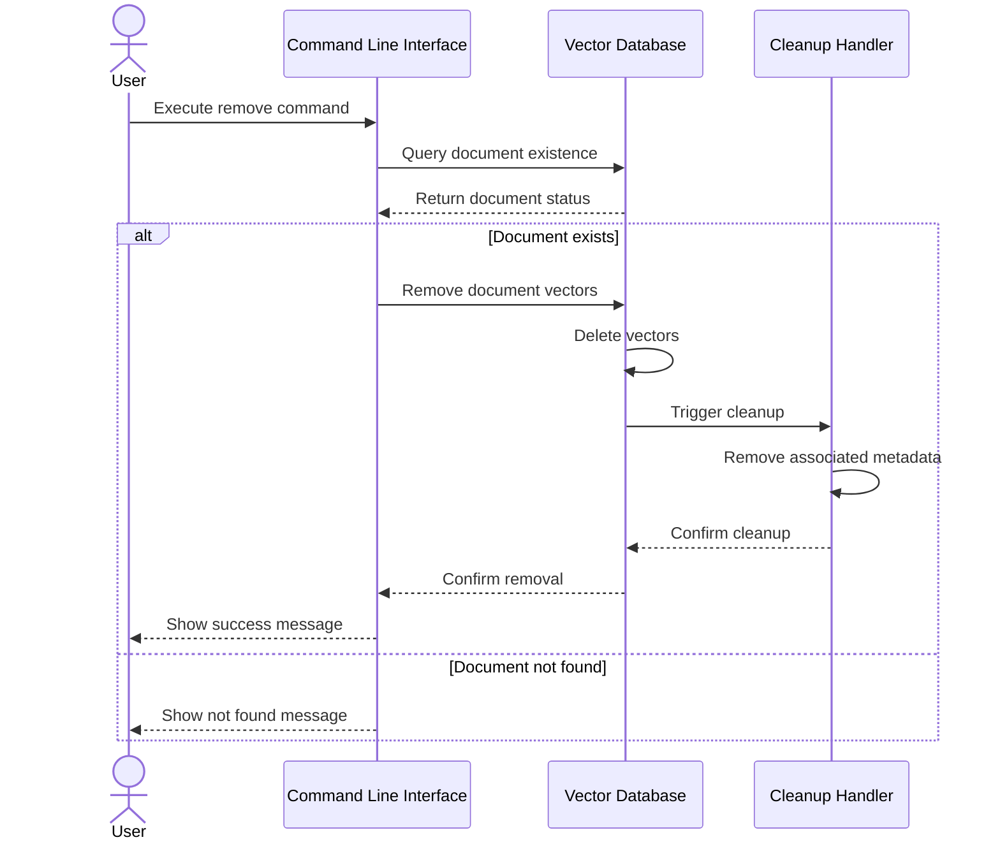
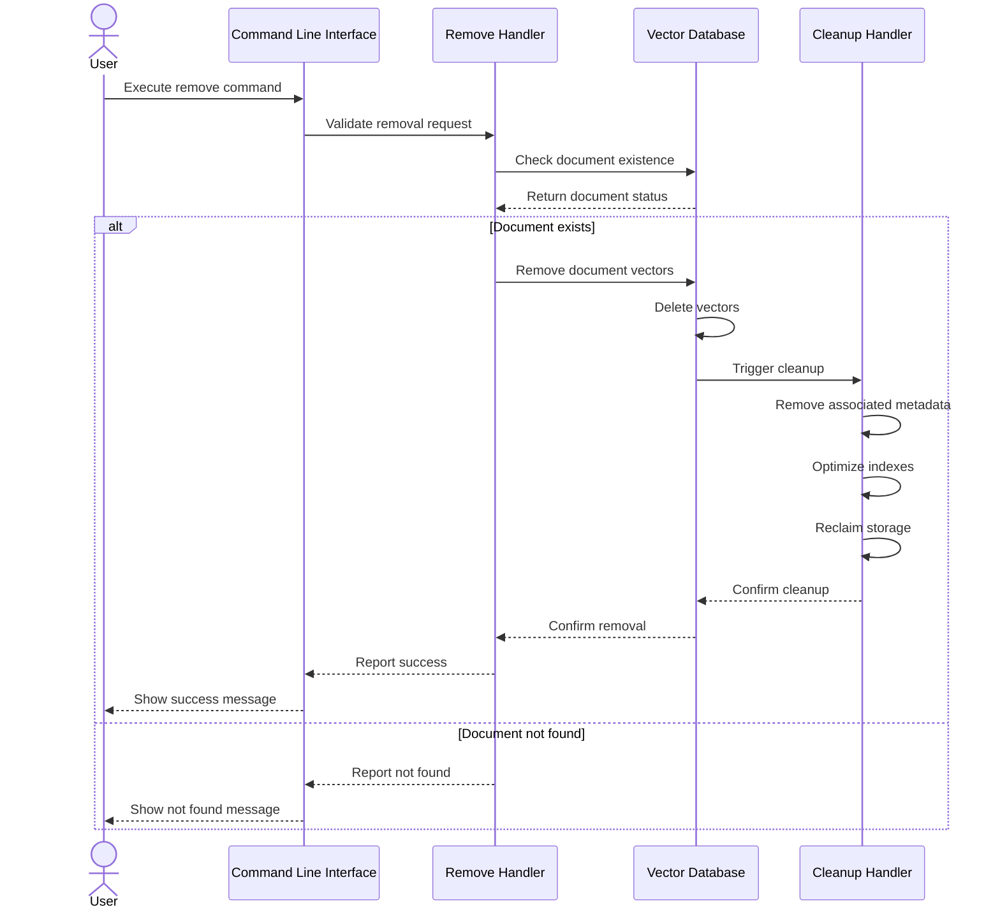

# Removal Flow



# Remove Flow Components

This document details the components specific to the file removal flow in the File Embedding System.

## Remove Flow Overview

The remove flow handles the safe deletion of files and their associated data from the system. It ensures that all vectors, metadata, and related information are properly cleaned up while maintaining system consistency.

## Components

### Remove Handler
- **Purpose**: Manages document removal from the system
- **Key Functions**:
  - Document validation
    - Verifies file existence in vector database
    - Checks for dependencies and relationships
  - Vector removal
    - Removes embeddings from vector store
    - Updates indexes
  - Metadata cleanup
    - Removes associated metadata
    - Updates relationship graphs
  - Consistency checks
    - Verifies complete removal
    - Ensures no orphaned data
- **Technologies**:
  - Database transactions
  - Atomic operations

### Cleanup Handler
- **Purpose**: Ensures system consistency after removals
- **Key Functions**:
  - Orphaned data cleanup
    - Identifies and removes orphaned vectors
    - Cleans up unused metadata
  - Index optimization
    - Rebalances vector indexes
    - Updates search structures
  - Storage reclamation
    - Recovers disk space
    - Compacts database files
  - Verification checks
    - Validates database integrity
    - Confirms complete cleanup
- **Technologies**:
  - Database maintenance tools
  - File system operations

## Remove Flow Sequence



## Error Handling

### Common Error Scenarios
1. **Document Not Found**
   - System reports file not present in database
   - No changes made to system state

2. **Partial Removal**
   - System detects incomplete removal
   - Triggers additional cleanup
   - Logs warning for manual review

3. **Dependency Conflicts**
   - System identifies dependent documents
   - Provides option for cascade removal
   - Warns user of implications

### Recovery Procedures
1. **Transaction Rollback**
   - All operations are transactional
   - System state preserved on failure
   - Detailed error logging for debugging

2. **Integrity Verification**
   - Post-removal consistency check
   - Automatic repair of minor issues
   - Notification for major problems

## Configuration Options

```yaml
REMOVE_HANDLER:
  CASCADE_DELETE: false  # Whether to automatically remove dependent documents
  VERIFY_REMOVAL: true   # Run verification after removal
  OPTIMIZE_AFTER: true   # Run optimization after removal
  
CLEANUP_HANDLER:
  AUTO_COMPACT: true     # Automatically compact storage
  COMPACT_THRESHOLD: 100 # Number of removals before compaction
  VERIFY_CLEANUP: true   # Run verification after cleanup
``` 