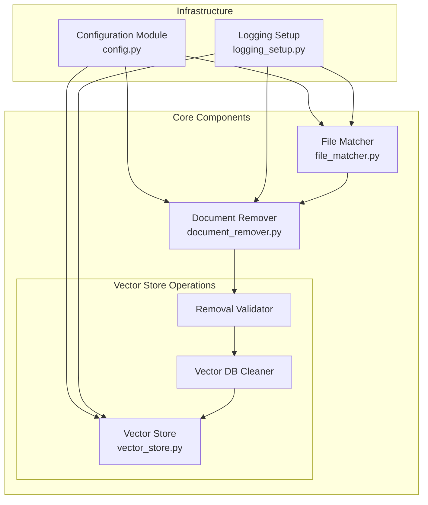

# File Removal System Architecture Document

## 1. System Overview

### 1.1 Purpose
The File Removal System is designed to efficiently remove file entries and their associated vector embeddings from the vector database. The system ensures clean removal of data while maintaining database integrity and providing verification of removal success.

### 1.2 Key Features
- Selective file removal from vector database
- Batch removal capabilities
- Removal verification
- Comprehensive logging
- Database integrity maintenance

## 2. System Architecture

### 2.1 High-Level Components



The diagram above shows the key components of the file removal system and their relationships:

1. **Infrastructure Layer**:
   - Configuration Module: Centralizes all system settings
   - Logging Setup: Provides unified logging across components

2. **Core Components**:
   - File Matcher: Identifies files for removal
   - Document Remover: Orchestrates the removal process
     - Contains the Removal Validator and Vector DB Cleaner subcomponents
   - Vector Store: Manages vector database operations

3. **Key Relationships**:
   - All components use centralized configuration and logging
   - File Matcher feeds files to Document Remover
   - Document Remover validates and cleans through its subcomponents
   - Vector Store handles the actual database operations

### 2.2 Component Details

**Note**: The following components are logically grouped within the Document Remover module shown in the architecture diagram:

#### 2.2.1 File Matcher

- **Purpose**: Identifies and validates files for removal based on input paths or patterns by checking against the vector database
- **Integration with Configuration Module**:
  - Uses config.py to load configuration settings
  - Retrieves FILE_MATCHER settings through config object

- **Vector Store Integration**:
  ```python
  from remove_files.vector_store import VectorStore
  from remove_files.document_remover import DocumentRemover

  class FileMatcher:
      def __init__(self, vector_store: VectorStore, document_remover: DocumentRemover):
          self.vector_store = vector_store
          self.document_remover = document_remover
          self.logger = logging.getLogger(__name__)

      def find_matching_files(self, pattern: str) -> list[str]:
          """Find files in vector store matching the given pattern."""
          logger.info(f"Finding files matching pattern: {pattern}")
          
          # Query vector store for all document IDs
          all_docs = self.vector_store.get_all_documents()
          
          # Match pattern against documents
          matches = [doc for doc in all_docs if self._matches_pattern(doc, pattern)]
          logger.debug(f"Found {len(matches)} matching files")
          
          return matches
          
      def remove_matching_files(self, pattern: str) -> bool:
          """Remove files matching pattern from vector store."""
          matches = self.find_matching_files(pattern)
          if matches:
              logger.info(f"Removing {len(matches)} matched files")
              return self.document_remover.remove_documents(matches)
          return True

#### 2.2.2 Removal Validator

- **Purpose**: Validates removal requests and ensures database integrity
- **Key Functions**:
  - Verification of file existence in database
  - Impact assessment of removal
  - Backup consideration for critical files
- **Technologies**:
  - Python
  - Database validation tools

#### 2.2.3 Vector Database Cleaner

- **Purpose**: Handles the actual removal of vectors and metadata from the database
- **Key Functions**:
  - Safe removal of vector embeddings
  - Cleanup of associated metadata
  - Batch removal processing
  - Integrity verification post-removal
- **Technologies**:
  - Chroma DB
  - Database management tools

### 2.3 Data Flow

#### 2.3.1 Removal Process Flow

1. System receives file paths or patterns to remove
2. File Matcher:
   - Validates input patterns
   - Identifies matching files in database
   - Generates removal candidate list
3. Removal Validator:
   - Verifies each file's existence
   - Checks for dependencies
   - Assesses removal impact
4. Vector Database Cleaner:
   - Removes vector embeddings
   - Cleans up metadata
   - Verifies removal success

## 3. Technical Specifications

### 3.1 System Requirements

- **Hardware**:
  - Minimum 16GB RAM
  - Multi-core processor
  - SSD storage for vector database
- **Software**:
  - Python 3.13+
  - Vector database system
  - Database management tools

### 3.2 Configuration and Main Modules

The system is organized under the `remove_files` directory, which contains all the core modules and components described in this section.

#### 3.2.1 Main Module (__main__.py)

- **Purpose**: Command-line interface and entry point for the file removal system
- **Input Arguments**:
  - `--remove`: Path or pattern to remove (can be multiple)
  - `--config`: Path to configuration file (default: './config/config.yaml')
  - `--debug`: Flag to enable debug logging
  - `--dry-run`: Flag to simulate removal without actual deletion
  - `--force`: Flag to skip confirmation prompts
- **Output**:
  - Exit code 0: Successful removal
  - Exit code 1: Error occurred
  - Console output for progress and errors
  - Log file entries
- **Usage Examples**:
  ```bash
  # Remove a specific file
  python -m remove_files --remove /path/to/docs/specific_file.md

  # Remove multiple files using patterns
  python -m remove_files --remove "*.pdf" --remove "old_docs/*"

  # Dry run to see what would be removed
  python -m remove_files --remove "*.md" --dry-run

  # Force remove without confirmation
  python -m remove_files --remove "temp/*" --force

  # Use custom config file
  python -m remove_files --remove "*.pdf" --config /path/to/custom/config.yaml
  ```

- **Logging Integration**:
  - Uses centralized logging setup from `logging_setup.py` (section 3.2.3)
  - Initializes logging during system startup
  - Logs command-line arguments, execution progress, and errors
  - Provides console feedback for interactive usage

- **Error Handling**:
  - Validates input arguments before processing
  - Provides clear error messages for invalid inputs
  - Handles interruptions gracefully
  - Ensures proper cleanup on failure

- **Integration with Other Modules**:
  - Coordinates with File Matcher for pattern processing
  - Works with Document Remover for actual file removal
  - Uses Configuration Module for settings management
  - Leverages centralized logging for operation tracking

#### 3.2.2 Configuration Module (config.py)

- **Purpose**: Central configuration management system that provides base configuration for all system modules
- **Role**: Acts as the single source of truth for configuration, ensuring consistent settings across the entire system
- **Input**:
  - Configuration file path (optional, defaults to './config/config.yaml')
  - Environment variables with 'QA_' prefix
- **Output**: Config object with sections:
  - `LOGGING`: Logging settings
    - `LEVEL`: Log level setting
    - `LOG_FILE`: Path to log file
  - `FILE_MATCHER`: File matching settings
    - `RECURSIVE`: Enable recursive matching for directory patterns
    - `CASE_SENSITIVE`: Case sensitivity in matching
  - `REMOVAL_VALIDATION`: Validation settings
    - `REQUIRE_CONFIRMATION`: Whether to require confirmation before removing files
  - `VECTOR_STORE`: Vector database configuration
    - `TYPE`: Vector store implementation
    - `PERSIST_DIRECTORY`: Data storage location
    - `COLLECTION_NAME`: Name of collection

- **Module Integration**:
  - All system modules must obtain their base configuration through this module
  - Modules can extend the base configuration with component-specific settings
  - Example usage:
    ```python
    from remove_files.config import get_config
    
    # Get base configuration
    config = get_config()
    
    # Access module-specific settings while inheriting base configuration
    logging_config = config.get_nested('LOGGING')
    matcher_config = config.get_nested('FILE_MATCHER')
    vector_store_config = config.get_nested('VECTOR_STORE')
    ```

#### 3.2.3 Logging Setup (logging_setup.py)
- **Purpose**: Configures centralized logging for the remove_files system
- **Integration with Main**:
  - Called during system initialization
  - Configures both file and console logging handlers
- **Input**:
  - `LOG_FILE`: Path to the log file (defaults to 'logs/remove_files.log')
  - `LOG_LEVEL`: Logging level (from config.LOGGING.LEVEL, default: "INFO")
  - `DEBUG`: Flag to enable debug logging (default: False)
- **Output**:
  - Configured root logger with both file and console handlers
  - Rotating log files with specified size limits and backup counts
  - Formatted log messages with timestamp, logger name, level, and message
- **Usage**:
```python
from remove_files.config import get_config
from remove_files.logging_setup import setup_logging

# Load configuration
config = get_config()

# Setup logging using configuration values
setup_logging(
    LOG_FILE=config.get_nested('LOGGING.LOG_FILE', default="logs/remove_files.log"),
    LOG_LEVEL=config.get_nested('LOGGING.LEVEL', default="INFO"),
    DEBUG=config.get_nested('LOGGING.DEBUG', default=False)
)
```

Key Features:
- Configuration-driven setup
- Automatic log directory creation (creates 'logs' directory if it doesn't exist)
- Log rotation to manage file sizes
- Consistent log formatting across handlers
- Debug mode support
- Console output for immediate feedback
- Thread-safe logging implementation

Log Format:
```
YYYY-MM-DD HH:MM:SS - logger_name - LEVEL - Message
```

Example Log Entry:
```
2024-03-20 14:30:45 - remove_files.file_matcher - INFO - Removing document: example.pdf
```

#### 3.2.4 File Matcher (file_matcher.py)
- **Purpose**: Identifies and validates files for removal based on input paths or patterns by checking against the vector database
- **Integration with Configuration Module**:
  - Uses config.py to load configuration settings
  - Retrieves FILE_MATCHER settings through config object

- **Vector Store Integration**:
  ```python
  from remove_files.vector_store import VectorStore
  from remove_files.document_remover import DocumentRemover

  class FileMatcher:
      def __init__(self, vector_store: VectorStore, document_remover: DocumentRemover):
          self.vector_store = vector_store
          self.document_remover = document_remover
          self.logger = logging.getLogger(__name__)

      def find_matching_files(self, pattern: str) -> list[str]:
          """Find files in vector store matching the given pattern."""
          logger.info(f"Finding files matching pattern: {pattern}")
          
          # Query vector store for all document IDs
          all_docs = self.vector_store.get_all_documents()
          
          # Match pattern against documents
          matches = [doc for doc in all_docs if self._matches_pattern(doc, pattern)]
          logger.debug(f"Found {len(matches)} matching files")
          
          return matches
          
      def remove_matching_files(self, pattern: str) -> bool:
          """Remove files matching pattern from vector store."""
          matches = self.find_matching_files(pattern)
          if matches:
              logger.info(f"Removing {len(matches)} matched files")
              return self.document_remover.remove_documents(matches)
          return True

#### 3.2.5 Document Removal Interface (document_remover.py)
- **Purpose**: Orchestrates the document removal process and provides interfaces for vector store operations
- **Key Components**:
  - Connection management
  - Query operations
  - Batch processing
  - Error handling
  - Removal validation
  - Progress tracking
  - Cleanup verification

- **Logging Integration**:
  ```python
  from remove_files.logging_setup import setup_logging
  import logging

  # Get logger for this module
  logger = logging.getLogger(__name__)

  class DocumentRemover:
      def __init__(self, vector_store, config):
          self.vector_store = vector_store
          self.config = config
          self.logger = logging.getLogger(__name__)
          
      def remove_documents(self, file_paths):
          self.logger.info(f"Starting removal of {len(file_paths)} documents")
          try:
              # Remove vectors by document IDs
              self.vector_store.remove_documents(file_paths)
              self.logger.debug(f"Successfully removed documents: {file_paths}")
          except Exception as e:
              self.logger.error(f"Error during document removal: {str(e)}")
              raise
  ```

- **Vector Store Integration**:
  ```python
  from remove_files.vector_store import VectorStore
  
  vector_store = VectorStore(config)
  # Remove vectors by document IDs
  vector_store.remove_documents(doc_ids)
  # Verify removal
  vector_store.verify_removal(doc_ids)
  ```

- **Document Removal Implementation**:
  ```python
  from remove_files.document_remover import DocumentRemover
  
  remover = DocumentRemover(vector_store, config)
  # Process removal request
  remover.remove_documents(file_paths)
  # Verify and cleanup
  remover.verify_and_cleanup()
  ```

#### 3.2.6 Vector Store System (vector_store.py)
- **Purpose**: Manages vector database operations, including storage, retrieval, and removal of document vectors

- **Integration with Configuration and Logging**:
  ```python
  import logging
  from remove_files.logging_setup import setup_logging
  from remove_files.config import get_config

  logger = logging.getLogger(__name__)

  class VectorStore:
      def __init__(self, config):
          self.config = config
          self.logger = logging.getLogger(__name__)
          self.persist_directory = config.get_nested('VECTOR_STORE.PERSIST_DIRECTORY')
          self.collection_name = config.get_nested('VECTOR_STORE.COLLECTION_NAME')
          self.logger.debug(f"Initializing vector store in {self.persist_directory}")
  ```

- **Core Operations**:
  ```python
  def remove_documents(self, doc_ids: list[str]) -> bool:
      """Remove documents and their vectors from the store."""
      try:
          self.logger.info(f"Removing {len(doc_ids)} documents from vector store")
          # Implementation of vector removal
          self.logger.debug(f"Successfully removed documents: {doc_ids}")
          return True
      except Exception as e:
          self.logger.error(f"Error removing documents: {str(e)}")
          raise

  def verify_removal(self, doc_ids: list[str]) -> bool:
      """Verify documents were successfully removed."""
      self.logger.debug(f"Verifying removal of {len(doc_ids)} documents")
      # Implementation of removal verification
      return True
  ```

- **Key Features**:
  - Chromadb integration for vector storage
  - Batch operations support
  - Automatic connection management
  - Error recovery mechanisms
  - Performance optimization
  - Data integrity checks

- **Error Handling**:
  - Connection errors
  - Database operation failures
  - Data integrity issues
  - Resource cleanup
  - Transaction management

- **Performance Considerations**:
  - Connection pooling
  - Batch processing optimization
  - Resource management
  - Memory usage monitoring
  - Query optimization
