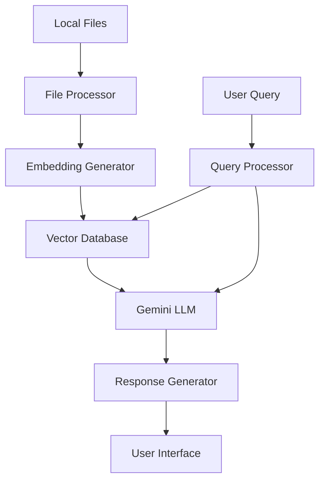

**Navigation:**

- Parent:: [System Documentation](../README.md)
- Peer:: [Implementation Guide](./implementation.md)
- Child:: [Component Details](./components.md)

# Local File Question-Answering System Architecture Document

## Table of Contents

1. [System Overview](#1-system-overview)
   - [Purpose](#11-purpose)
   - [Key Features](#12-key-features)
2. [System Architecture](#2-system-architecture)
   - [High-Level Components](#21-high-level-components)
   - [Component Details](#22-component-details)
   - [Data Flow](#23-data-flow)
3. [Technical Specifications](#3-technical-specifications)
   - [System Requirements](#31-system-requirements)
   - [API Specifications](#32-api-specifications)
   - [Security Considerations](#33-security-considerations)
4. [Implementation Strategy](#4-implementation-strategy)
5. [Monitoring and Maintenance](#5-monitoring-and-maintenance)
6. [Future Considerations](#6-future-considerations)
7. [Dependencies](#7-dependencies)
8. [User Interaction](#8-user-interaction)

## 1. System Overview

### 1.1 Purpose
The Local File Question-Answering System is designed to function as an advanced research assistant, capable of handling complex and nebulous queries by leveraging Google Gemini's sophisticated language model capabilities. The system processes and indexes local files to provide well-reasoned, comprehensive responses that demonstrate clear analytical thinking and contextual understanding.

### 1.2 Key Features
- Local file processing and embedding generation
- Vector database storage for efficient similarity search
- Integration with Google Gemini for question answering
- Support for multiple file formats
- Scalable document processing pipeline
- Real-time query processing

## 2. System Architecture

### 2.1 High-Level Components



### 2.2 Component Details

#### 2.2.1 File Processor

- **Purpose**: Handles ingestion and preprocessing of local files
- **Key Functions**:
  - File format detection and validation
  - Text extraction from various formats (PDF, DOCX, TXT, etc.)
  - Content chunking for optimal processing
  - Rich metadata extraction:
    - Directory structure context (relative path, directory hierarchy)
    - File metadata (creation time, modification time)
    - Document relationships (links, references)
    - Semantic tags and classifications
  - YAML frontmatter parsing
  - Markdown-specific processing:
    - Hashtag extraction and normalization
    - Link relationship mapping
    - Document cross-reference tracking
- **Technologies**:
  - Python with specialized libraries (PyPDF2, python-docx)
  - Apache Tika for complex file formats
  - Custom chunking algorithms
  - YAML parser for frontmatter
  - Regular expressions for metadata extraction

#### 2.2.1.1 Document Metadata and Relationships

- **Core Metadata**:
  - `path`: Absolute file path
  - `relative_path`: Path relative to workspace root
  - `directory`: Full directory hierarchy
  - `parent_directory`: Immediate parent directory
  - `filename_stem`: Descriptive filename without extension
  - `file_type`: Document format/extension
  - `classification`: Document classification level
  - `created_at`: Creation timestamp
  - `last_modified`: Last modification timestamp
  - `chunk_count`: Number of text chunks
  - `total_tokens`: Total token count

- **Markdown-Specific Metadata**:
  - `frontmatter`: YAML metadata from document header
  - `hashtags`: Comma-separated list of extracted tags
  - `hashtags_list`: Original hashtag list for semantic search
  - `links`: Comma-separated list of document links
  - `links_list`: Original link list for relationship mapping
  - `linked_documents`: Cross-referenced markdown documents

- **Relationship Mapping**:
  - Parent-child document relationships
  - Cross-document references
  - Semantic grouping via hashtags
  - Directory-based categorization
  - Version tracking through timestamps

#### 2.2.2 Embedding Generator

- **Purpose**: Creates vector embeddings for document chunks
- **Key Functions**:
  - Text normalization
  - Embedding generation using Google's embedding models
  - Batch processing for efficiency
  - Embedding validation and error handling
- **Technologies**:
  - Google's Embedding API
  - NumPy for vector operations
  - Batch processing queue

#### 2.2.3 Vector Database

- **Purpose**: Stores and indexes document embeddings
- **Key Functions**:
  - Efficient vector storage and retrieval
  - Similarity search capabilities
  - Metadata management
  - Index optimization
- **Technologies**:
  - Chroma DB or Milvus
  - PostgreSQL with pgvector extension (alternative)
  - Redis for caching

#### 2.2.4 Query Processor

- **Purpose**: Handles user queries with advanced reasoning capabilities
- **Key Functions**:
  - Query expansion for semantic understanding
  - Multi-perspective query analysis
  - Context retrieval and relevance scoring
  - Structured thinking and reasoning path generation
  - Response synthesis with supporting evidence
- **Technologies**:
  - Google Gemini Pro Experimental API
  - Advanced prompt engineering
  - Query optimization algorithms
  - Semantic similarity analysis

#### 2.2.5 Gemini LLM Integration

- **Purpose**: Provides intelligent, well-reasoned responses with clear analytical thinking
- **Key Functions**:
  - Structured thinking process
  - Multi-step reasoning
  - Context analysis and synthesis
  - Source evaluation and integration
  - Confidence scoring with explanation
  - Uncertainty acknowledgment
- **Technologies**:
  - Google Gemini 2.5 Pro Experimental
  - Advanced prompt templates
  - Response validation
  - Reasoning path tracking

### 2.3 Data Flow

#### 2.3.1 Document Ingestion Flow

1. System monitors designated folders for new files
2. File Processor validates and processes new files:
   - Extracts text content and YAML frontmatter
   - Generates rich metadata including directory context
   - Maps document relationships and cross-references
   - Processes hashtags and links for semantic grouping
3. Content is chunked into optimal segments
4. Embedding Generator creates vectors for each chunk
5. Vectors and metadata are stored in Vector Database with:
   - Complete document context
   - Relationship mappings
   - Semantic groupings
   - Directory structure context

#### 2.3.2 Query Processing Flow
1. User submits query through interface
2. Query Processor expands query to capture multiple perspectives
3. Vector Database performs similarity search for each perspective
4. Relevant contexts are retrieved and deduplicated
5. Gemini LLM analyzes context through structured thinking steps:
   - Context analysis and evaluation
   - Question breakdown and requirement identification
   - Supporting evidence gathering
   - Response formulation with reasoning path
6. Well-reasoned response with sources returned to user

## 3. Technical Specifications

### 3.1 System Requirements

- **Hardware**:
  - Minimum 16GB RAM
  - Multi-core processor
  - SSD storage for vector database
- **Software**:
  - Python 3.9+
  - Docker for containerization
  - Vector database system
  - Google Cloud SDK

### 3.2 API Specifications

```python
# Core API Interfaces

class DocumentProcessor:
    async def process_document(self, file_path: str) -> DocumentMetadata:
        """Process a document and generate embeddings."""
        pass

class QueryEngine:
    async def process_query(self, query: str) -> QueryResponse:
        """Process a user query and generate response."""
        pass

class VectorStore:
    async def store_embeddings(self, embeddings: List[Vector], metadata: DocumentMetadata):
        """Store document embeddings and metadata."""
        pass
    
    async def similarity_search(self, query_embedding: Vector, k: int) -> List[SearchResult]:
        """Perform similarity search."""
        pass
```

### 3.3 Security Considerations

- File access permissions
- API key management
- Data encryption at rest
- Secure communication channels
- User authentication and authorization
- Rate limiting and quota management

## 4. Implementation Strategy

### 4.1 Phase 1: Core Infrastructure

- Set up development environment
- Implement basic file processing
- Integrate embedding generation
- Set up vector database
- Basic query processing

### 4.2 Phase 2: Gemini Integration

- Implement Gemini Pro Experimental API integration
- Develop advanced prompt engineering for structured thinking
- Add multi-step reasoning capabilities
- Implement context analysis and synthesis
- Add reasoning path generation and tracking
- Implement confidence scoring with explanations

### 4.3 Phase 3: Optimization

- Add batch processing
- Implement caching
- Optimize vector search
- Add monitoring and logging
- Performance tuning

### 4.4 Phase 4: UI and Features

- Develop user interface
- Add advanced features
- Implement feedback loop
- Add analytics and reporting

## 5. Monitoring and Maintenance

### 5.1 Key Metrics

- Query response time
- Embedding generation time
- Vector search performance
- Memory usage
- API quota utilization
- Error rates

### 5.2 Logging Strategy

- Application logs
- Error tracking
- Performance metrics
- User interaction logs
- System health monitoring

## 6. Future Considerations

### 6.1 Scalability

- Distributed processing
- Cluster deployment
- Horizontal scaling
- Load balancing

### 6.2 Feature Roadmap

- Enhanced reasoning capabilities
- Multi-perspective query understanding
- Structured thinking templates
- Source reliability scoring
- Context synthesis improvements
- Reasoning path visualization
- User feedback integration for continuous improvement
- Advanced uncertainty handling
- Integration with domain-specific knowledge bases

## 7. Dependencies

### 7.1 External Services

- Google Gemini API
- Google Cloud Platform
- Vector database service

### 7.2 Libraries and Frameworks

- langchain for LLM orchestration
- chromadb/milvus for vector storage
- FastAPI for API development
- pydantic for data validation
- pytest for testing 

## 8. User Interaction

### 8.1 Interface Options

#### 8.1.1 Command Line Interface (CLI)

```bash
# Show help message
qa_system

# Enter interactive conversation mode
qa_system config.yaml

# Add documents to the system
qa_system config.yaml --add /path/to/documents/*

# Ask a question (non-interactive mode)
qa_system config.yaml --ask "What is the release schedule for the product?"

# List indexed documents
qa_system config.yaml --list

# Remove documents
qa_system config.yaml --remove doc_id
```

#### Command Line Modes

1. **Help Mode** (no parameters)
   - Displays comprehensive help message
   - Shows available commands and their usage
   - Provides configuration file format example
   - Lists common use cases

2. **Interactive Mode** (config file only)
   - Enters conversational interface
   - Maintains conversation context
   - Allows direct question input
   - Supports conversation history

3. **Directive Mode** (config file + directive)
   - Executes specific command and exits
   - Available directives:
     - `add`: Index new documents
     - `ask`: One-time question answering
     - `list`: Show indexed documents
     - `remove`: Delete documents
     - `cleanup`: Automatically remove excluded files from the vector DB

#### 8.1.2 Slack Interface

- Interactive Slack bot integration using Slack's Bolt framework
- Features:
  - Direct file uploads in Slack channels or DMs
  - Natural conversation-based question answering
  - Document management through slash commands
  - Thread-based context preservation
  - Rich message formatting with source citations
  - File preview and snippet support
  - Channel-specific document collections

#### 8.1.3 Python API

```python
from qa_system import QASystem

# Initialize the system
qa = QASystem()

# Add documents
qa.add_documents("/path/to/documents/*")

# Ask questions
response = qa.ask("What is the release schedule?")
print(response.answer)
print(response.sources)  # List of source documents and relevant excerpts

# Manage documents
docs = qa.list_documents()
qa.remove_document(doc_id)
```

### 8.2 Usage Examples

#### 8.2.1 CLI Usage

```bash
# receive help menu
$ qa_system

# Enter interactive chat mode
$ qa_system ./config/config.yaml 

# Index a directory of technical documentation
$ qa_system ./config/config.yaml --add ./technical-docs/
✓ Processing 23 files...
✓ Generated embeddings for 156 chunks
✓ Documents indexed successfully

# Ask a question
$ qa_system ./config/config.yaml --ask "What are the system requirements for deployment?"
Searching relevant documents...
Answer: The system requires:
- Minimum 16GB RAM
- Multi-core processor
- SSD storage
- Python 3.9+
Source: technical-docs/deployment.md

# List the files in the vector DB
$ qa_system ./config/config.yaml --list

# Remove files from the vector DB
$ qa_system ./config/config.yaml --remove ./docs/path/filename.md

# Cleanup the vector DB
$ qa_system ./config/config.yaml --cleanup

# Show the system status
$ qa_system ./config/config.yaml --status
```

#### 8.2.2 Slack Interface Workflow

1. **Document Management**
   - Upload files directly in Slack channels or DMs
   - Use `/qa_system list` to view indexed documents
   - Organize documents by channels
   - Use `/qa_system remove` to delete documents

2. **Research Assistant Interaction**
   - Ask complex or nebulous questions
   - Receive well-reasoned responses with:
     - Clear analytical thinking steps
     - Supporting evidence from sources
     - Confidence levels and uncertainty acknowledgment
     - Reasoning paths and explanations
   - Follow-up questions maintain context and build on previous reasoning
   - React with emojis for feedback on response quality

### 8.3 Integration Options

#### 8.3.1 Slack Event API

```http
# Event Subscriptions
POST /api/v1/slack/events
Content-Type: application/json
{
    "type": "message",
    "channel": "C1234567890",
    "user": "U1234567890",
    "text": "What is the release schedule?",
    "ts": "1234567890.123456"
}

# Slash Commands
POST /api/v1/slack/commands
Content-Type: application/x-www-form-urlencoded
command=/qa-docs&text=list&channel_id=C1234567890

# Interactive Components
POST /api/v1/slack/actions
Content-Type: application/json
{
    "type": "block_actions",
    "action_id": "show_sources",
    "channel": "C1234567890"
}
```

#### 8.3.2 Real-time Messaging

- Event-driven updates for document processing
- Asynchronous response handling for long queries
- Interactive message components
- Thread-based conversation management

### 8.4 Security and Access Control

#### 8.4.1 Authentication

- Slack OAuth 2.0 authentication
- Channel-based access control
- Workspace member verification
- Admin-only commands

#### 8.4.2 Usage Limits

- Rate limiting per channel/user
- File size restrictions aligned with Slack limits
- Concurrent request management
- Storage quotas per workspace 