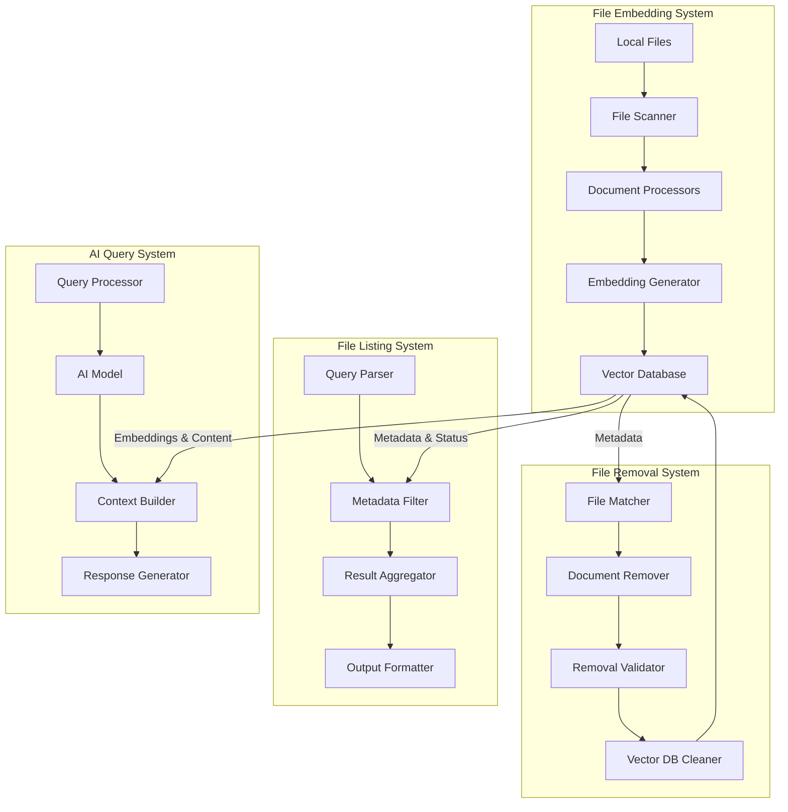

# Vector Database System Architecture

## 1. System Overview

### 1.1 Purpose
The Vector Database System is designed to manage the lifecycle of document embeddings, from initial processing and storage to eventual removal. The system consists of four main subsystems:

1. **File Embedding System**: Processes local files and generates vector embeddings using Google Gemini's model
2. **File Removal System**: Manages the removal of file entries and their associated vector embeddings
3. **File Listing System**: Provides efficient querying and listing of indexed files with metadata and status information
4. **AI Query System**: Enables semantic search and intelligent querying of documents using AI models

### 1.2 Key Features
- Complete document lifecycle management
- Support for multiple file formats
- Efficient batch processing
- Comprehensive metadata tracking
- Safe and verifiable removal process
- Robust logging and monitoring
- Advanced file querying and listing capabilities
- AI-powered semantic search and question answering
- Context-aware document retrieval

## 2. System Architecture

### 2.1 High-Level Components

### 2.2 Subsystems

#### 2.2.1 File Embedding System
The embedding system handles the ingestion and processing of files:
- Detailed architecture: [Embedding System Architecture](ARCHITECTURE-embed_files.md)
- Key components:
  - File Scanner: Discovers and validates files
  - Document Processors: Extract and normalize content
  - Embedding Generator: Creates vector embeddings
  - Vector Database Integration: Stores embeddings and metadata

#### 2.2.2 File Removal System
The removal system manages the safe deletion of files and their embeddings:
- Detailed architecture: [Removal System Architecture](ARCHITECTURE-remove_files.md)
- Key components:
  - File Matcher: Identifies files for removal
  - Document Remover: Orchestrates removal process
  - Removal Validator: Ensures safe deletion
  - Vector DB Cleaner: Handles database operations

#### 2.2.3 File Listing System
The listing system provides efficient querying and status reporting:
- Key components:
  - Query Parser: Interprets search criteria and filters
  - Metadata Filter: Applies filtering rules to database entries
  - Result Aggregator: Combines and sorts query results
  - Output Formatter: Formats results for display or export
- Features:
  - Advanced query capabilities (by type, status, date)
  - Metadata-based filtering
  - Customizable output formats
  - Batch operation support
  - Performance optimized for large datasets

#### 2.2.4 AI Query System
The AI query system enables intelligent document search and question answering:
- Key components:
  - Query Processor: Analyzes and structures user queries
  - AI Model: Processes queries using advanced language models
  - Context Builder: Retrieves and assembles relevant document context
  - Response Generator: Creates coherent and accurate responses
- Features:
  - Natural language query support
  - Semantic search capabilities
  - Multi-document context integration
  - Source attribution and citations
  - Confidence scoring
  - Query refinement suggestions

### 2.3 Shared Components

#### 2.3.1 Vector Database
- Central storage for both subsystems
- Manages embeddings and metadata
- Ensures data integrity
- Provides efficient search capabilities

#### 2.3.2 Configuration System
Both subsystems share a common configuration approach:
- YAML-based configuration files
- Environment variable support
- Consistent configuration structure
- Centralized configuration management

#### 2.3.3 Logging System
Unified logging across both subsystems:
- Consistent log formatting
- Centralized log configuration
- Log rotation support
- Debug mode capabilities
