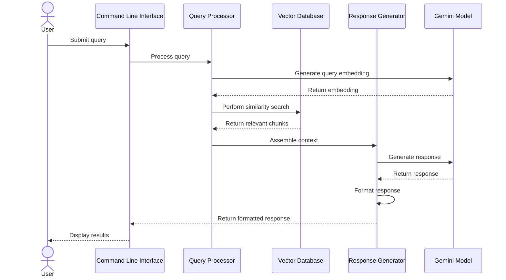

# Table of Contents
1. [Overview](#1-overview)
2. [System Flow](#2-system-flow)
3. [Components](#3-components)
   3.1. [Query Processor](#31-query-processor)
   3.2. [Response Generator](#32-response-generator)
   3.3. [Hybrid Scoring: Semantic + Metadata (Key Points)](#33-hybrid-scoring-semantic--metadata-key-points)
4. [Query Types](#4-query-types)
   4.1. [Basic Query](#41-basic-query)
   4.2. [Advanced Query](#42-advanced-query)
   4.3. [Hybrid Query](#43-hybrid-query)
5. [Configuration](#5-configuration)
6. [Technical Specifications](#6-technical-specifications)
7. [Integration](#7-integration)
8. [Usage](#8-usage)
   8.1. [Command Line Interface](#81-command-line-interface)
   8.2. [Python API Usage](#82-python-api-usage)
   8.3. [Response Object Structure](#83-response-object-structure)
9. [Response Formats](#9-response-formats)
   9.1. [Default Format](#91-default-format)
   9.2. [Detailed Format](#92-detailed-format)

# 1. Overview

The query flow enables semantic search capabilities across processed documents. It converts user queries into vector embeddings, performs similarity searches, and generates contextually relevant responses using the Gemini model.

- **Embeddings and Text Generation**: Uses the Google Gemini API for both embedding generation and text generation, following the latest API usage patterns (see [Gemini API Docs](https://ai.google.dev/gemini-api/docs/text-generation)).
- **Security**: API keys are loaded securely from environment variables (see examples below).
- **Document Processing**: Relies on the chunking, metadata, and document processor architecture described in [ARCHITECTURE-add-flow.md](ARCHITECTURE-add-flow.md#32-document-processors).
- **Reference Examples**: See [`reference_example/talk_to_documents_with_embeddings_example.py`](reference_example/talk_to_documents_with_embeddings_example.py) and [`reference_example/text_generation_example.py`](reference_example/text_generation_example.py) for working code.

# 2. System Flow



# 3. Components
Implementation of the Google Gemini AI models must follow the API guide found here: https://ai.google.dev/gemini-api/docs/text-generation and the working code in [reference_example/talk_to_documents_with_embeddings_example.py](reference_example/talk_to_documents_with_embeddings_example.py) and [reference_example/text_generation_example.py](reference_example/text_generation_example.py).

## 3.1 Query Processor
- **Purpose**: Handles semantic search queries and manages the search process
- **Dependencies**:
  - [Configuration Module](ARCHITECTURE-common-components.md#3-configuration-module) for query settings
  - [Logging Setup](ARCHITECTURE-common-components.md#4-logging-setup) for operation tracking
  - [Vector Database](ARCHITECTURE-common-components.md#5-vector-database) for similarity search
  - [Exceptions Module](ARCHITECTURE-common-components.md#6-exceptions-module) for error handling
- **Key Functions**:
  - Query embedding generation
    - Converts text queries to vector embeddings
    - Normalizes query format
  - Similarity search execution
    - Performs vector similarity calculations
    - Filters results based on metadata
    - Logs detailed vector store results and similarity calculations at DEBUG level for each query, including ids, documents, distances, and metadatas.
    - Applies a minimum similarity threshold (default 0.2, configurable via `QUERY.MIN_SIMILARITY`) to filter sources before context assembly and output.
    - Checks and logs whether relevant documents (by keyword) are present in the top results, aiding in debugging chunking/indexing issues.
  - Result ranking
    - Scores and ranks search results
    - Applies relevance filtering
  - Context assembly
    - Gathers relevant document chunks
    - Builds context for response generation
    - Only includes sources above the minimum similarity threshold and deduplicates by document.
- **Technologies**:
  - Vector similarity algorithms
  - Result ranking algorithms

## 3.2 Response Generator
- **Purpose**: Generates contextual responses using retrieved information
- **Dependencies**:
  - [Configuration Module](ARCHITECTURE-common-components.md#3-configuration-module) for response settings
  - [Logging Setup](ARCHITECTURE-common-components.md#4-logging-setup) for operation tracking
  - [Exceptions Module](ARCHITECTURE-common-components.md#6-exceptions-module) for error handling
- **Key Functions**:
  - Context integration
    - Combines retrieved chunks
    - Orders information by relevance
  - Response generation
    - Uses Gemini model for response
    - Ensures factual accuracy
  - Source attribution
    - Links responses to source documents
    - Provides confidence scores
  - Response formatting
    - Structures output for readability
    - Includes relevant metadata
- **Technologies**:
  - Gemini API
  - Rich text formatting

## 3.3 Hybrid Scoring: Semantic + Metadata (Key Points)

Hybrid Scoring combines semantic similarity with metadata-based adjustments to improve the relevance and contextual accuracy of search results. This approach is especially effective when users do not specify explicit filters, allowing the system to surface more meaningful results automatically.

### Key Points

- **Automatic Relevance Boosting:** Results are ranked not only by semantic similarity but also by how well their metadata matches implicit or inferred user needs (e.g., recency, document type, tags).
- **No User Input Required:** Users simply enter their query; the system applies metadata-based boosts or penalties transparently.
- **Customizable Scoring:** The scoring function can be tuned to prioritize certain metadata fields (e.g., boost recent documents, preferred sources, or matching tags).
- **Implementation Flow:**
    1. Perform standard semantic search to retrieve candidate results and similarity scores.
    2. For each result, evaluate relevant metadata fields (e.g., date, tags, source).
    3. Adjust the similarity score by applying boosts/penalties based on metadata matches.
    4. Re-rank results by the new hybrid score before returning to the user.
- **Example Metadata Boosts:**
    - Recent documents (e.g., last 12 months)
    - Documents with tags matching query keywords
    - Official or preferred sources
- **Benefits:**
    - Improves result relevance without complicating the user experience
    - Surfaces contextually important documents that might otherwise be missed
    - Adaptable to evolving business or user needs
- **Implementation Notes:**
    - Identify which metadata fields are most valuable for your use case (e.g., date, tags, source, author).
    - Integrate a scoring function in the query pipeline to adjust similarity scores post-search.
    - Tune boost/penalty values based on testing and feedback.
    - Optionally, log or explain to users why certain results are ranked higher (for transparency).

# 4. Query Types

## 4.1 Basic Query
- Simple text query
- Returns most relevant documents
- Basic relevance scoring

## 4.2 Advanced Query
- Supports filters and constraints
- Metadata-based filtering
- Custom ranking options

## 4.3 Hybrid Query
- Combines text and metadata search
- Weighted relevance scoring
- Advanced filtering options

# 5. Configuration

The query flow is configured through several sections in the configuration file. These must match the structure and field names used in the add flow (see [ARCHITECTURE-add-flow.md](ARCHITECTURE-add-flow.md#324-configuration)):

```yaml
# Security Configuration
SECURITY:
  GEMINI_API_KEY: ${GEMINI_API_KEY}    # Google Gemini API credentials (from environment)
  GOOGLE_CLOUD_PROJECT: ${GOOGLE_CLOUD_PROJECT}

# Vector Database Configuration
VECTOR_STORE:
  TYPE: "chroma"                        # Vector store implementation
  PERSIST_DIRECTORY: "./data/vector_store"  # Data storage location
  COLLECTION_NAME: "qa_documents"       # Collection name

# Query-Specific Parameters
QUERY:
  # Retrieval/Search Parameters
  DISTANCE_METRIC: "cosine"         # (str) Similarity metric for vector search: "cosine", "euclidean", etc.
  TOP_K: 40                         # (int) Number of top results to retrieve per query
  MIN_SIMILARITY: 0.2               # (float) Minimum similarity threshold for source inclusion (0.0-1.0, default 0.2)

  # Hybrid Scoring/Metadata Boosts
  RECENCY_BOOST: 1.0                # (float) Boost for recent documents (1.0 = neutral, >1.0 = boost, <1.0 = penalty)
  TAG_BOOST: 1.0                    # (float) Boost for tag matches (1.0 = neutral, >1.0 = boost, <1.0 = penalty)
  SOURCE_BOOST: 1.5                 # (float) Boost for preferred sources (1.0 = neutral, >1.0 = boost, <1.0 = penalty)
  PREFERRED_SOURCES:
    - "Library/Archive"

  # Generation Parameters (for Gemini or LLM response)
  TEMPERATURE: 0.2                  # (float) Controls randomness of generated text (0.0 = deterministic, 1.0 = creative)
  MAX_TOKENS: 512                   # (int) Maximum tokens in generated response
  CONTEXT_WINDOW: 4096              # (int) Number of tokens of context to pass to the model
```

> **Note:**
> All embedding operations (for both document ingestion and query-time search) must use the `EmbeddingGenerator` class.

# 6. Technical Specifications

### System Requirements
- Python 3.13 or higher
- Gemini API access (API key via environment variable)
- Vector database support (ChromaDB)
- Sufficient memory for embedding operations

### Diagnostics and Debugging
- **Detailed DEBUG logging for vector store results and similarity calculations.**
- **Minimum similarity threshold for source inclusion (default 0.2, configurable).**
- **Logs warnings if relevant documents (by keyword) are not found in top results, to help diagnose chunking/indexing issues.**
- These diagnostics help ensure the right documents are surfaced and can be tuned for better retrieval quality.

### Dependencies
- `google-genai` (Gemini API integration)
- `chromadb` (Vector database operations)
- `numpy` (Vector operations and calculations)
- `pydantic` (Data validation and settings management)
- `python-dotenv` (for loading environment variables from `.env`)

### Performance Considerations
- Query processing: < 100ms
- Embedding generation: < 500ms per query
- Vector search: < 200ms for up to 100k documents
- Response generation: < 2s for typical queries

### Error Handling
- Query validation errors
- Embedding generation failures
- Vector search timeouts
- Response generation limits
- Rate limiting and quotas
- API key/configuration errors (fail fast if missing)

# 7. Integration

### Common Components Integration
- Uses logging setup from [ARCHITECTURE-common-components.md](ARCHITECTURE-common-components.md)
- Follows configuration patterns defined in common components
- Utilizes shared error handling and monitoring
- **Document Processing and Metadata**: All query results and context assembly rely on the chunking, metadata, and document processor architecture described in [ARCHITECTURE-add-flow.md](ARCHITECTURE-add-flow.md#32-document-processors). Chunk-level metadata is preserved throughout the query and response flow.

### Vector Store Integration
- Interfaces with vector database for similarity search
- Maintains consistent metadata format with add/remove flows
- Supports transaction management for query operations

### Security Integration
- Implements authentication and authorization checks
- Manages API keys and credentials securely (see below)
- Follows security best practices from common components

#### Secure API Key Handling Example
```python
from dotenv import load_dotenv
import os

load_dotenv()
GEMINI_API_KEY = os.getenv("GEMINI_API_KEY")
if not GEMINI_API_KEY:
    raise RuntimeError("GEMINI_API_KEY not set in environment.")
```

# 8. Usage

## 8.1 Command Line Interface
```bash
# Start interactive chat mode
python -m qa_system --query                                 # Enter interactive chat session
python -m qa_system --query --debug                        # Interactive chat with debug logging

# Single query mode
python -m qa_system --query "What is the project about?"    # One-shot query
python -m qa_system --query "Find documents about logging"  # Search specific topics

# With custom configuration
python -m qa_system --query --config custom_config.yaml     # Use custom configuration
```

## 8.2 Python API Usage

### Embedding and Similarity Search Example
```python
from qa_system.embedding import EmbeddingGenerator

embedding_generator = EmbeddingGenerator(config)
embedding_result = embedding_generator.generate_embeddings([query], metadata={"task_type": "RETRIEVAL_QUERY"})
query_vector = embedding_result['vectors'][0]
# Use query_vector for similarity search in the vector store
```

### Text Generation Example
```python
from google import genai
from dotenv import load_dotenv
import os

load_dotenv()
GEMINI_API_KEY = os.getenv("GEMINI_API_KEY")
client = genai.Client(api_key=GEMINI_API_KEY)

response = client.models.generate_content(
    model="gemini-1.5-flash-latest",
    contents="Write a story about a magic backpack."
)
print(response.text)
```

### Full Query Flow Example

Below is an example of running an **interactive chat session** with the query processor. This is the primary usage mode for the query flow module and demonstrates how users interact with the system in real time. This example should always be included in documentation for this module.

```python
from qa_system.query_processor import QueryProcessor
from qa_system.config import get_config
from qa_system.logging_setup import setup_logging

config = get_config()
setup_logging(
    LOG_FILE=config.get_nested('LOGGING.LOG_FILE'),
    LEVEL=config.get_nested('LOGGING.LEVEL', default="INFO")
)
processor = QueryProcessor(config)

# Single query mode
query = "What are the main features of the system?"
response = processor.process_query(query)
print(f"Response: {response.text}")
print(f"Sources: {response.sources}")

# Interactive chat session
def chat_session():
    processor = QueryProcessor(config)
    
    try:
        while True:
            query = input("\nEnter your question (or 'exit' to quit): ")
            if query.lower() in ['exit', 'quit']:
                break
                
            response = processor.process_query(query)
            print("\nResponse:", response.text)
            
            if response.sources:
                print("\nSources:")
                for source in response.sources:
                    print(f"- {source.document} (similarity: {source.similarity:.2f})")
    except KeyboardInterrupt:
        print("\nChat session ended.")

# Example response handling
response = processor.process_query("How does the logging system work?")
if response.success:
    print("Answer:", response.text)
    print("\nRelevant documents:")
    for source in response.sources:
        print(f"- {source.document}")
        print(f"  Similarity: {source.similarity:.2f}")
        print(f"  Context: {source.context[:100]}...")
else:
    print("Error:", response.error)
```

## 8.3 Response Object Structure
```python
class QueryResponse:
    text: str                # Generated response text
    sources: List[Source]    # List of source documents used
    confidence: float        # Response confidence score (0.0-1.0)
    processing_time: float   # Time taken to generate response
    error: Optional[str]     # Error message if query failed
    success: bool           # Whether query was successful

class Source:
    document: str           # Source document path
    chunk: str             # Relevant text chunk
    similarity: float      # Similarity score (0.0-1.0)
    context: str           # Surrounding context
    metadata: dict         # Additional document metadata
```

# 9. Response Formats

## 9.1 Default Format
```json
{
  "response": "Generated response text",
  "sources": [
    {
      "document": "document_name.txt",
      "chunk": "Relevant chunk text",
      "similarity": 0.85
    }
  ],
  "metadata": {
    "confidence": 0.92,
    "processing_time": "0.5s"
  }
}
```

## 9.2 Detailed Format
```json
{
  "response": {
    "text": "Generated response text",
    "sections": [
      {
        "content": "Section content",
        "sources": ["doc1.txt", "doc2.pdf"],
        "confidence": 0.95
      }
    ]
  },
  "sources": [
    {
      "document": "document_name.txt",
      "chunk": "Relevant chunk text",
      "similarity": 0.85,
      "metadata": {
        "file_type": "text",
        "last_modified": "2024-03-20",
        "chunk_index": 3
      }
    }
  ],
  "metadata": {
    "confidence": 0.92,
    "processing_time": "0.5s",
    "tokens_used": 450,
    "query_embedding": {
      "dimensions": 768,
      "model": "text-embedding-004"
    }
  }
}
```