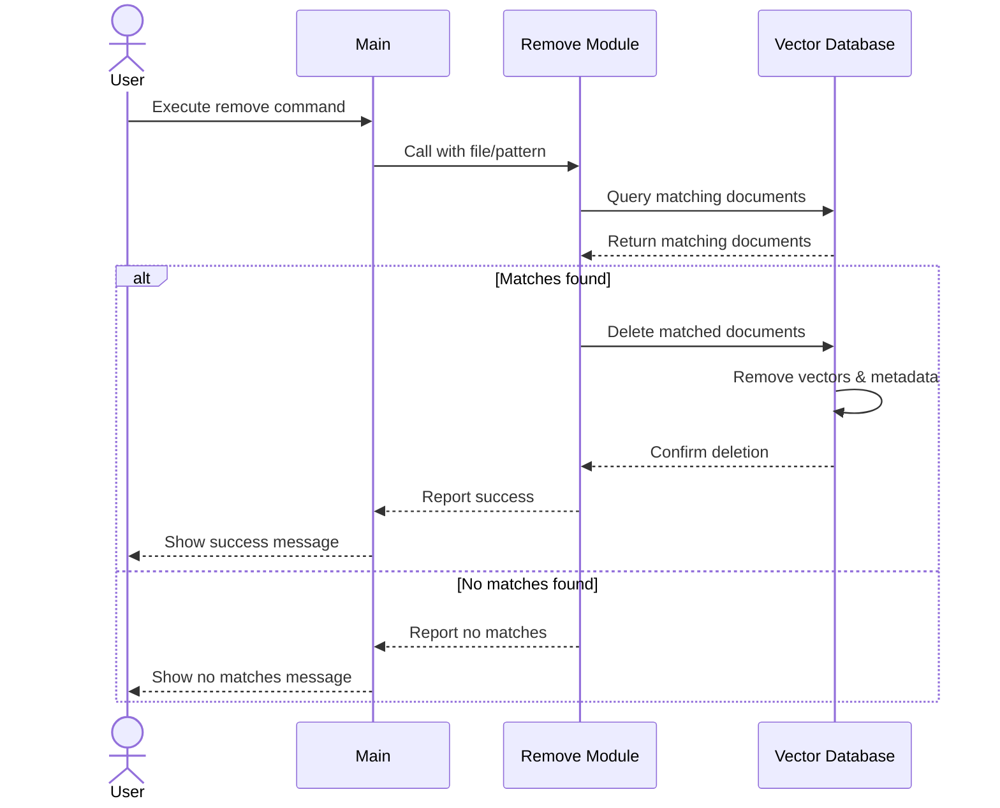

# Table of Contents
1. [Overview](#1-overview)
2. [System Flow](#2-system-flow)
3. [Components](#3-components)
   3.1. [Remove Module](#31-remove-module)
      3.1.1. [Remove Module (remove_handler.py)](#311-remove-module-remove_handlerpy)
   3.2. [Vector Database](#32-vector-database)
4. [Error Handling](#4-error-handling)
   4.1. [Common Error Scenarios](#41-common-error-scenarios)
   4.2. [Recovery Procedures](#42-recovery-procedures)
   4.3. [Exceptions Module Integration](#43-exceptions-module-integration)
5. [Configuration](#5-configuration)
6. [Usage Examples](#6-usage-examples)
   6.1. [Command Line Interface](#command-line-interface)
   6.2. [Python API](#python-api)

# 1. Overview
The remove flow handles the safe deletion of files and their associated data from the system. It ensures that all vectors, metadata, and related information are properly cleaned up while maintaining system consistency.

# 2. System Flow



# 3. Components

## 3.1. Remove Module
- **Purpose**: Handles pattern matching and removal of documents from the vector database
- **Dependencies**:
  - [Configuration Module](ARCHITECTURE-common-components.md#3-configuration-module) for removal settings
  - [Logging Setup](ARCHITECTURE-common-components.md#4-logging-setup) for operation tracking
  - [Vector Database](ARCHITECTURE-common-components.md#5-vector-database) for document removal
  - [Exceptions Module](ARCHITECTURE-common-components.md#6-exceptions-module) for error handling
- **Key Functions**:
  - Pattern matching for file selection
    - Supports exact file paths
    - Supports glob patterns (*.pdf, docs/*.txt, etc)
    - Directory path handling
  - Document querying
    - Searches vector database for matching documents
    - Returns list of matches with metadata
  - Document removal
    - Batch removal of matched documents
    - Cleanup of associated vectors and metadata
    - Consistency verification
- **Technologies**:
  - Python pathlib for path handling
  - glob pattern matching
  - Vector database operations

### 3.1.1. Remove Module (remove_handler.py)
- **Purpose**: Implements document removal logic including pattern matching, document querying, and vector store cleanup
- **Integration with Main**:
  - Receives paths/patterns from main's --remove argument
  - Receives configuration either from default or main's --config argument
  - Loads VECTOR_STORE configuration from config.py for Vector DB integration
  - Utilizes Exceptions Module for standardized error handling
- **Input**:
  - `pattern`: File or pattern to match (from main's --remove argument)
  - `vector_db`: Instance of Vector DB for document operations
  - Configuration settings (from config.REMOVE_HANDLER):
    - `BATCH_SIZE`: Number of documents to remove in each batch
    - `VERIFY_REMOVAL`: Whether to verify complete removal
    - `RECURSIVE`: Whether to match patterns recursively
- **Output**:
  - Dictionary containing:
    - `removed`: List of successfully removed documents
    - `failed`: List of documents that failed to remove
    - `not_found`: List of patterns with no matches
    - `errors`: List of error details with exception information
- **Key Functions**:
  - `find_matches`: Queries vector store for documents matching pattern
  - `remove_documents`: Removes matched documents from vector store
  - `verify_removal`: Confirms complete removal of documents and metadata
  - `handle_exceptions`: Processes and formats exceptions using Exceptions Module

## 3.2. Vector Database
The remove flow utilizes the vector database component described in [ARCHITECTURE-common-components.md](ARCHITECTURE-common-components.md#5-vector-database) for all document operations including:
- Pattern matching against stored documents
- Removal of document vectors
- Cleanup of associated metadata
- Consistency verification

For configuration and usage details, see [Vector Database Configuration](ARCHITECTURE-common-components.md#52-configuration).

# 4. Error Handling

## 4.1 Common Error Scenarios
1. **Document Not Found**
   - System reports file not present in database
   - No changes made to system state

2. **Partial Removal**
   - System detects incomplete removal
   - Triggers additional cleanup
   - Logs warning for manual review

3. **Dependency Conflicts**
   - System identifies dependent documents
   - Provides option for cascade removal
   - Warns user of implications

## 4.2 Recovery Procedures
1. **Transaction Rollback**
   - All operations are transactional
   - System state preserved on failure
   - Detailed error logging for debugging

2. **Integrity Verification**
   - Post-removal consistency check
   - Automatic repair of minor issues
   - Notification for major problems

## 4.3 Exceptions Module Integration
The remove flow leverages the [Exceptions Module](ARCHITECTURE-common-components.md#6-exceptions-module) for standardized error handling:

1. **Custom Exceptions**
   - `DocumentNotFoundError`: When specified documents don't exist
   - `RemovalError`: For general removal operation failures
   - `ValidationError`: For pattern validation failures

2. **Exception Flow**
   - Exceptions are caught and logged at appropriate levels
   - User-facing messages are generated from exception details
   - System state is preserved through transaction management

3. **Error Reporting**
   - Detailed error information for debugging
   - User-friendly error messages
   - Consistent error format across operations

# 5. Configuration

The remove flow uses configuration settings from the following sections of the [common configuration](ARCHITECTURE-common-components.md#3-configuration-module):

- `DATA_REMOVER`: Remove-specific settings
  ```yaml
  DATA_REMOVER:
    # Enable recursive matching for directory patterns
    RECURSIVE: true
    # Case sensitivity in matching
    CASE_SENSITIVE: false
    # Whether to require confirmation before removing files
    REQUIRE_CONFIRMATION: true
  ```

- `VECTOR_STORE`: Vector database settings (see [Vector Database Configuration](ARCHITECTURE-common-components.md#54-configuration))

For detailed information about shared configuration settings, including logging and security, refer to the [Configuration Module documentation](ARCHITECTURE-common-components.md#3-configuration-module).

# 6. Usage Examples

## Command Line Interface
```bash
# Remove a single file
python -m qa_system --remove /path/to/document.pdf

# Remove multiple files
python -m qa_system --remove file1.md --remove file2.pdf

# Remove with pattern matching
python -m qa_system --remove "*.pdf"  # Remove all PDF files
python -m qa_system --remove "/docs/*.md"  # Remove markdown files in docs directory

# Remove with custom configuration
python -m qa_system --remove document.pdf --config custom_config.yaml

# Remove with debug logging
python -m qa_system --remove document.pdf --debug

# Remove directory recursively
python -m qa_system --remove /path/to/old_docs/

# Remove with confirmation prompt
python -m qa_system --remove document.pdf --confirm
```

## Python API
```python
from qa_system.remove_handler import RemoveHandler
from qa_system.config import get_config

# Initialize components
config = get_config()
handler = RemoveHandler(config)

# Remove using exact path
result = handler.remove_documents("/path/to/document.pdf")

# Remove using pattern
result = handler.remove_documents("*.pdf")

# Remove multiple patterns
result = handler.remove_documents([
    "/path/to/doc1.pdf",
    "docs/*.md"
])

# Remove with custom options
result = handler.remove_documents(
    "/path/to/document.pdf",
    recursive=True,
    verify_removal=True,
    require_confirmation=True
)

# Handle results
if result['removed']:
    print(f"Successfully removed: {result['removed']}")
if result['failed']:
    print(f"Failed to remove: {result['failed']}")
if result['not_found']:
    print(f"No matches found for: {result['not_found']}")

# Error handling example
from qa_system.exceptions import DocumentNotFoundError, RemovalError, ValidationError

try:
    result = handler.remove_documents("invalid/pattern/**")
except ValidationError as e:
    print(f"Invalid pattern: {e}")
    # Access detailed error information
    print(f"Error code: {e.code}")
    print(f"Error context: {e.context}")
except DocumentNotFoundError as e:
    print(f"Document not found: {e}")
    # Log the error with full context
    logger.error(f"Document removal failed: {e}", extra=e.to_dict())
except RemovalError as e:
    print(f"Removal failed: {e}")
    # Handle cleanup if needed
    if e.requires_cleanup:
        handler.cleanup_failed_removal(e.document_id) 