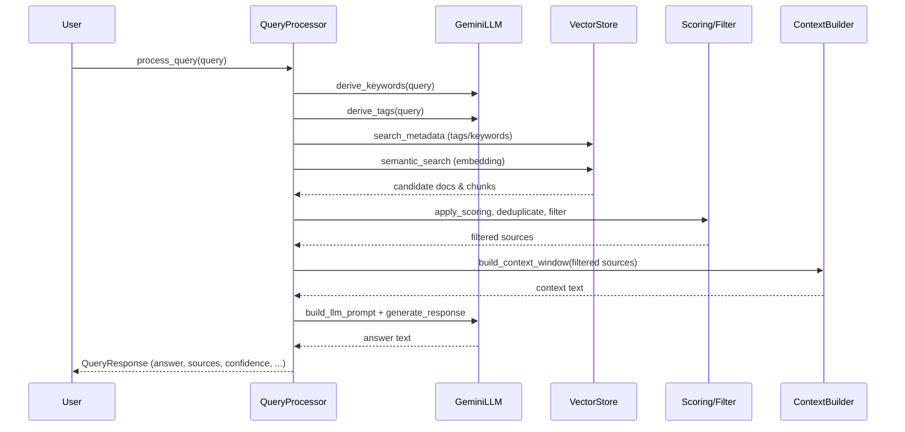

# Query Module (`qa_system/query`)

## Overview

The `qa_system.query` module implements the core semantic search and question-answering pipeline for the QA system. It enables users to ask natural language questions over a document corpus, leveraging hybrid retrieval (semantic + metadata/tag search), advanced scoring, and a Large Language Model (LLM) to generate contextual, well-cited answers.

## Key Components

- **QueryProcessor**: Main class orchestrating the query pipeline. Handles query processing, hybrid retrieval, scoring, filtering, context construction, and LLM interaction.
- **Source**: Data model representing a single document chunk/source contributing to an answer, including similarity, context, and metadata.
- **QueryResponse**: Data model for the full response to a query, including the answer text, sources, confidence, timing, and error info.
- **Scoring & Filtering Utilities**: Functions for hybrid scoring (semantic + metadata boosts), deduplication, and filtering of sources.
- **Prompt & Context Builders**: Utilities for constructing LLM prompts and assembling the context window from filtered sources.
- **GeminiLLM**: Wrapper for interacting with the Gemini LLM API.

## Query Pipeline

1. **User Query**: User submits a natural language question.
2. **Keyword/Tag Extraction**: The system uses the LLM to extract relevant keywords and tags from the query for hybrid retrieval.
3. **Hybrid Retrieval**:
    - **Tag/Keyword Search**: Finds candidate documents by matching tags and keywords in metadata.
    - **Semantic Search**: Generates an embedding for the query and retrieves top-k similar document chunks from the vector store.
4. **Source Construction**: Builds standardized `Source` objects from vector store results.
5. **Scoring & Deduplication**: Applies hybrid scoring (semantic similarity + recency/tag/source boosts) and deduplicates sources by document.
6. **Filtering**: Filters sources by similarity thresholds and tag-matching criteria.
7. **Context Window Building**: Assembles a context window from the top filtered sources, respecting the LLM's context limit.
8. **Prompt Construction**: Builds a prompt for the LLM using the user question and the constructed context.
9. **LLM Call**: Sends the prompt to the Gemini LLM and receives an answer.
10. **Response Assembly**: Returns a `QueryResponse` containing the answer, sources, confidence, timing, and any errors.

## Sequence Diagram



## Example Usage

```python
from qa_system.query import QueryProcessor

# Assume `config` is your configuration object
processor = QueryProcessor(config)
response = processor.process_query("What is data governance?")
print("Answer:", response.text)
print("Sources:", [src.document for src in response.sources])
```

## Configuration & Extensibility

- The pipeline is highly configurable via the `config` object (embedding, vector store, LLM, scoring, and filtering parameters).
- Components such as the embedding generator, vector store, and LLM can be swapped or extended by passing custom instances to `QueryProcessor`.
- Logging is integrated throughout for observability and debugging.

## User Interaction Logging

- User questions and answers are logged to per-day markdown files in the directory specified by `USER_INTERACTION_DIRECTORY` (e.g., `./data/user_interaction/2025-05-20.md`).
- Each entry in the log contains a timestamp, the user question, and the generated answer, in a structured markdown format.
- The contextualizer reads all `.md` files in this directory to generate contextual summaries for future queries.

## File Structure

- `processor.py`: Main pipeline logic (`QueryProcessor`)
- `models.py`: Data models (`Source`, `QueryResponse`)
- `scoring.py`, `source_filter.py`: Scoring, deduplication, and filtering utilities
- `context_builder.py`: Context window construction
- `prompts.py`: LLM prompt construction
- `gemini_llm.py`: Gemini LLM API wrapper
- `keywords.py`: Keyword/tag extraction utilities
- `source_utils.py`: Source normalization from vector results

---

For more details, see the docstrings in each module and class. 